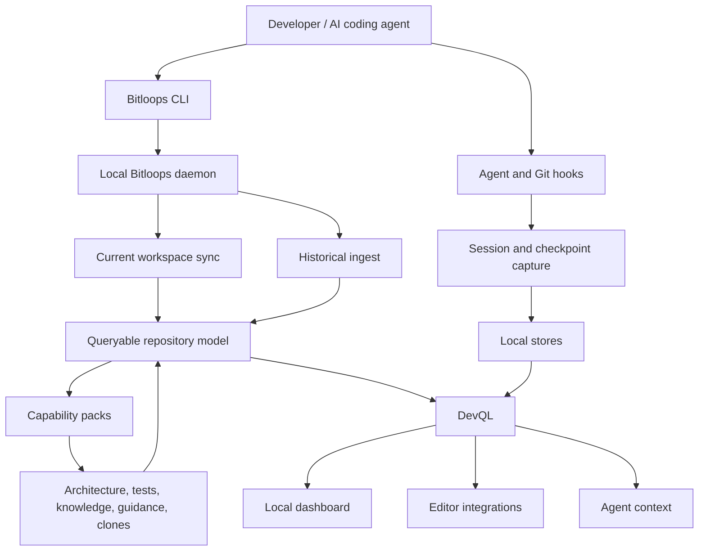

<div align="center">
  
  <h1>Codebase truth maintenance for AI agents.</h1>
  <p>
    <strong>Bitloops builds and maintains a local, typed, queryable model of your codebase so AI agents, developers, and reviewers can work from shared system state instead of rediscovering the repository from raw text.</strong>
  </p>
  <p>
    <a href="https://bitloops.com">Website</a>
    ·
    <a href="https://bitloops.com/docs/">Docs</a>
    ·
    <a href="https://bitloops.com/docs/getting-started/quickstart">Quickstart</a>
    ·
    <a href="https://bitloops.com/docs/concepts/devql">DevQL</a>
    ·
    <a href="https://github.com/bitloops/bitloops/discussions">Discussions</a>
  </p>

[](https://github.com/bitloops/bitloops/network/)
[](https://github.com/bitloops/bitloops/stargazers/)
[](https://github.com/bitloops/bitloops/commits/)
[](https://github.com/bitloops/bitloops/tags/)
[](https://github.com/bitloops/bitloops/releases)
[](https://github.com/bitloops/bitloops/blob/main/LICENSE)
[](https://github.com/bitloops/bitloops)
[](https://github.com/bitloops/bitloops)

</div>

> [!WARNING]
> **Project status: alpha / work in progress**
>
> Bitloops is under active development in the open and is **not production-ready yet**.
> Expect breaking changes, evolving documentation, rough onboarding edges, and uneven
> support across environments while the system matures.

## What Bitloops Gives You

AI coding agents are powerful, but most of them still start every task by crawling the repository again: read files, grep for symbols, infer architecture, guess which tests matter, inspect old docs, and compress all of that into a prompt.

Bitloops gives them a maintained operating picture instead.

| You need | Bitloops gives you |
| --- | --- |
| Better agent context | A local, queryable model of files, artefacts, symbols, dependencies, tests, checkpoints, and history. |
| Less repeated repo crawling | Agents ask precise DevQL questions instead of rediscovering the same facts through `grep`, `cat`, and large context dumps. |
| Reviewable AI-assisted work | Sessions and checkpoints preserve prompts, transcript fragments, tool events, changed files, model/token metadata, and commit linkage. |
| Shared memory across agents | Claude Code, Codex, Cursor, Gemini, Copilot, and OpenCode can feed one repository-scoped model instead of creating isolated mental models. |
| Fresher repository understanding | Current-state sync and historical ingest keep repository facts aligned with the worktree and Git history. |
| A foundation for safer autonomy | Provenance, evidence, confidence, freshness, and lifecycle primitives are represented where available and are being expanded across the system. |

## Install

macOS, Linux, WSL:

```bash
curl -fsSL https://bitloops.com/install.sh | bash
```

Windows PowerShell:

```powershell
irm https://bitloops.com/install.ps1 | iex
```

Windows CMD:

```cmd
curl -fsSL https://bitloops.com/install.cmd -o install.cmd && install.cmd && del install.cmd
```

## Get Started

From the repository or subproject you want Bitloops to capture:

```bash
bitloops init --install-default-daemon
```

Then work normally with your AI coding agent and commit as usual. Bitloops installs managed hooks, starts or binds the local daemon as needed, captures relevant session context, and keeps the local repository model fresh through daemon workers and Git safety producers.

Open the local dashboard:

```bash
bitloops dashboard
```

Or visit:

```text
http://127.0.0.1:5667
```

Pause or resume capture for the current project:

```bash
bitloops disable
bitloops enable
```

Remove Bitloops-managed local artefacts from your machine:

```bash
bitloops uninstall --full
```

For detailed setup, configuration, troubleshooting, storage, and upgrade notes, use the [documentation site](https://bitloops.com/docs/).

## What You Can Do Today

Bitloops is alpha, but the current product already focuses on practical local workflows:

- initialize a repository and install managed agent/Git hooks;
- capture AI-agent sessions and checkpoint history;
- inspect captured work and repository intelligence in a local dashboard;
- query repository state through DevQL and GraphQL;
- model current and historical files, artefacts, dependencies, commits, tests, checkpoints, and capability-pack data;
- use supported agent integrations across Claude Code, Codex, Cursor, Gemini, Copilot, and OpenCode;
- keep data local by default, with optional remote stores, connectors, telemetry, and inference providers controlled by configuration and consent.

Some of the deeper truth-maintenance vision is still evolving. Bitloops already contains many primitives for provenance, confidence, freshness, stale-state handling, lifecycle state, and reviewability, but broader invalidation, governance, and human-approval flows are being built incrementally.

## Capabilities

Bitloops turns agent activity, repository structure, development history, tests,
and external knowledge into a local queryable model.

| Capability | What you get |
| --- | --- |
| **Agent context** | Agents can retrieve relevant files, artefacts, dependencies, tests, and prior reasoning without crawling the repo from scratch. |
| **Checkpoint history** | AI-assisted work is captured as sessions and checkpoints linked to commits, prompts, tool use, files read, and files changed. |
| **Repository intelligence** | Bitloops models files, symbols, artefacts, dependencies, branches, commits, and current workspace state. |
| **DevQL queries** | Developers, agents, dashboards, and editor tools can query the maintained codebase model through DevQL and GraphQL. |
| **Test and coverage awareness** | Bitloops can map tests, coverage, verification signals, and confidence back to code artefacts. |
| **Knowledge ingestion** | External knowledge from sources such as GitHub, Jira, and Confluence can become part of repository understanding. |
| **Semantic understanding** | Summaries, embeddings, semantic clone detection, and context guidance help agents reason beyond exact text matches. |
| **Architecture views** | Architecture graph and CodeCity-style views help expose structure, boundaries, dependencies, risks, and higher-level codebase shape where enabled. |
| **Freshness and re-evaluation** | Bitloops tracks when repository facts were produced, what code state they came from, and what should be refreshed as the repo changes. |
| **Local-first operation** | Bitloops runs locally by default, with optional remote stores, connectors, telemetry, and inference providers controlled by configuration and consent. |

## Who Bitloops Is For

- **Developers using AI agents** who want better context, fewer repeated repo scans, and a searchable trail of what the agent did.
- **Engineering teams and reviewers** who need to inspect AI-assisted work by reasoning, prompts, files read, tools used, and commit linkage, not only by diff.
- **Platform and AI-tool teams** who want a typed local substrate for repository intelligence, agent context, and review workflows.
- **Strategic readers** evaluating AI-native software engineering infrastructure where codebase knowledge compounds instead of disappearing into chat history.

## Why Bitloops Exists

AI coding is bottlenecked by state, not only generation.

A codebase is not fundamentally a pile of text. Text is the serialization format for a changing system of files, symbols, APIs, tests, dependencies, entry points, runtime assumptions, historical decisions, external knowledge, review state, and agent activity.

Most AI coding tools repeatedly force that structured system through an unstructured medium: prompt text, retrieved chunks, embeddings, and chat memory. The agent then has to infer the system again and again.

That loop looks like this:

```text
retrieve -> infer -> act -> forget
```

Bitloops changes the loop to:

```text
extract -> persist -> classify -> validate -> refresh -> act
```

The goal is not just better retrieval. The goal is durable codebase truth maintenance: maintain useful facts, relationships, evidence, history, freshness, and review state so future agents and humans can act from the same operating picture.

> Agents cannot reliably change systems they cannot model. Bitloops builds and maintains the model.

## How It Works



The CLI is the user control surface. The daemon coordinates long-running work: repository watching, current-state sync, historical ingest, task queues, capability consumers, enrichment workers, dashboard serving, and GraphQL endpoints.

DevQL is the typed product contract. GraphQL is the canonical API, with a terminal-friendly DSL layered on top for CLI use.

Example DevQL pipeline:

```text
repo("my-repo") -> asOf(ref:"main") -> artefacts(name:"findById") -> tests()
```

## How You Use Bitloops

| Surface | What you use it for |
| --- | --- |
| **CLI** | Initialize a repo, enable or disable capture, open the dashboard, inspect checkpoints, run diagnostics, and query DevQL. |
| **Local dashboard** | Browse captured AI-assisted work, checkpoints, repository intelligence, and DevQL-backed views in your browser. |
| **DevQL** | Ask precise questions about the maintained repository model instead of making agents crawl files manually. |
| **Agent integrations** | Let supported AI coding agents feed one repository-scoped model through normalized hooks, transcripts, prompts, tool events, and checkpoint data. |
| **Background daemon** | Keep the local model fresh, coordinate sync and ingest work, serve the dashboard, and expose logs when something needs attention. |

## Local-First Trust Model

Normal local use does not require cloud access to your codebase. By default, Bitloops keeps configuration, runtime state, relational data, event data, and blobs on your machine.

Optional connectors, remote stores, telemetry, and inference providers are controlled by configuration and consent. Deterministic analysis is preferred where facts can be known mechanically; inference is reserved for ambiguity, synthesis, semantic summaries, and novel cases.

| Data area | Default behavior | Optional direction |
| --- | --- | --- |
| Repository model | Local relational store | Postgres-backed remote/team setups |
| Interaction/event analytics | Local event store | ClickHouse-backed analytics setups |
| Runtime state | Local daemon-owned SQLite state | Local daemon lifecycle and recovery data |
| Checkpoint/session blobs | Local filesystem | S3 or GCS-backed blob storage |
| External knowledge | Connector-controlled imports | GitHub, Jira, and Confluence-backed knowledge sources |
| Telemetry | Consent-gated | Aggregated product analytics |

## Supported Agents And Languages

Supported agent integrations:

- Claude Code
- Codex
- Cursor
- Gemini
- Copilot
- OpenCode

Built-in language adapters:

- Rust
- TypeScript / JavaScript
- Python
- Go
- Java
- C#

## Documentation For Technical Teams

This README is intentionally user-first. Technical details live in the documentation:

- [Quickstart](https://bitloops.com/docs/getting-started/quickstart) for setup and first use;
- [DevQL](https://bitloops.com/docs/concepts/devql) for querying the maintained repository model;
- [Docs home](https://bitloops.com/docs/) for guides, concepts, reference, and troubleshooting;
- [Contributor documentation](https://bitloops.com/docs/contributors) for source builds, architecture, language/agent/capability extension guides, and testing workflows;
- [CONTRIBUTING.md](./CONTRIBUTING.md) for repository contribution rules.

## Roadmap Direction

Bitloops is moving toward stronger codebase truth maintenance:

- more accurate freshness, stale-state, and conflict signals;
- better review workflows for AI-assisted work;
- richer test, coverage, architecture, semantic, and knowledge context;
- deeper connector-backed knowledge from tools like GitHub, Jira, and Confluence;
- more agent and language support;
- optional team and remote backends while preserving local-first defaults;
- governed flows that can turn useful agent discoveries into reviewable, reusable system state.

## What Bitloops Is Not

Bitloops is not just a prompt wrapper, hook installer, dashboard, code search tool, vector database, documentation layer, chat memory, or generic RAG system.

Those can be surfaces or ingredients. The durable product is the maintained model of the codebase and development process.

## Community And Support

- Website: <https://bitloops.com>
- Docs: <https://bitloops.com/docs/>
- Issues: <https://github.com/bitloops/bitloops/issues>
- Discussions: <https://github.com/bitloops/bitloops/discussions>
- Security: [SECURITY.md](./SECURITY.md)
- Code of Conduct: [CODE_OF_CONDUCT.md](./CODE_OF_CONDUCT.md)

## License

Apache-2.0. See [LICENSE](./LICENSE).
