# TestLens Architecture

This overview reflects the current prototype as implemented in this repository.

The architecture is best read as a commit-addressed pipeline of domain milestones. These are not emitted runtime events today, but they are the major state transitions the system materializes:

- `Production Artefact Discovered`
- `Test Artefact Discovered`
- `Static Test Link Established`
- `Coverage Ingested`
- `Test Run Ingested`
- `Test Classification Derived`

Each node in the diagram names a concrete command, Rust module, fixture, or executable spec from this repository.

```mermaid
flowchart TD
  subgraph commands["CLI Commands (Top-Level Entry Points)"]
    cmdinit["testlens init<br/>src/cli.rs<br/>Commands::Init"]
    cmdprod["testlens ingest-production-artefacts<br/>src/cli.rs<br/>Commands::IngestProductionArtefacts"]
    cmdtests["testlens ingest-tests<br/>src/cli.rs<br/>Commands::IngestTests"]
    cmdcoverage["testlens ingest-coverage<br/>src/cli.rs<br/>Commands::IngestCoverage"]
    cmdresults["testlens ingest-results<br/>src/cli.rs<br/>Commands::IngestResults"]
    cmdquery["testlens query<br/>src/cli.rs<br/>Commands::Query"]
    cmdlist["testlens list<br/>src/cli.rs<br/>Commands::List"]
  end

  subgraph entry["CLI Runtime / Dispatch"]
    main["src/main.rs<br/>main()"]
    lib["src/lib.rs<br/>pub use app::run"]
    app["src/app.rs<br/>run()<br/>command dispatch"]
    cli["src/cli.rs<br/>Cli / Commands parser"]
    main --> lib --> app --> cli
  end

  subgraph handlers["Application Handlers"]
    hinit["Command handler<br/>src/app/commands/init.rs<br/>handle()"]
    hprod["Command handler<br/>src/app/commands/ingest_production_artefacts.rs<br/>handle()"]
    htests["Command handler<br/>src/app/commands/ingest_tests.rs<br/>handle()"]
    hcoverage["Command handler<br/>src/app/commands/ingest_coverage.rs<br/>handle()"]
    hresults["Command handler<br/>src/app/commands/ingest_results.rs<br/>handle()"]
    hquery["Query handler<br/>src/app/queries/query_artefact_harness.rs<br/>handle()"]
    hlist["Query handler<br/>src/app/queries/list_artefacts.rs<br/>handle()"]
  end

  subgraph repo["Repository Boundary"]
    repotraits["Repository traits<br/>src/repository/mod.rs<br/>TestHarnessRepository / TestHarnessQueryRepository"]
    reposqlite["SQLite implementation<br/>src/repository/sqlite.rs<br/>SqliteTestHarnessRepository"]
    domain["Domain records<br/>src/domain/mod.rs<br/>ArtefactRecord / TestLinkRecord / TestCoverageRecord / TestRunRecord"]
    repotraits --> reposqlite
    domain --> repotraits
  end

  subgraph inputs["Inputs"]
    repo["Target repo under analysis<br/>testlens-fixture-rust/<br/>testlens-fixture/"]
    lcov["Coverage input<br/>LCOV report"]
    jest["Result input<br/>Jest JSON"]
  end

  subgraph write["Write Model / Ingestion"]
    init["testlens init<br/>src/db/mod.rs<br/>init_database()"]
    prod["testlens ingest-production-artefacts<br/>src/app/commands/ingest_production_artefacts.rs<br/>Tree-sitter TS + Rust production symbols"]
    tests["testlens ingest-tests<br/>src/app/commands/ingest_tests.rs<br/>RustTestAdapter priority 0<br/>TypeScriptTestAdapter priority 1"]
    testsdetail["Static linkage internals<br/>collect_rust_import_paths()<br/>collect_rust_scoped_call_import_paths()<br/>collect_typescript_import_paths()<br/>collect_rust_suites() / collect_typescript_suites()<br/>match_called_production_artefacts()"]
    coverage["testlens ingest-coverage<br/>src/app/commands/ingest_coverage.rs<br/>parse_lcov_report()<br/>rebuild_classifications_from_coverage()"]
    results["testlens ingest-results<br/>src/app/commands/ingest_results.rs<br/>build_scenario_map()<br/>test_runs upsert"]
    prod --> tests
    prod --> coverage
    prod --> results
    tests --> coverage
    tests --> results
    tests --> testsdetail
  end

  subgraph db["SQLite Store"]
    schema["src/db/schema.rs<br/>artefacts<br/>test_links<br/>coverage_captures<br/>coverage_hits<br/>test_runs<br/>test_classifications"]
  end

  subgraph milestones["Domain Milestones"]
    m1["Production Artefact Discovered"]
    m2["Test Artefact Discovered"]
    m3["Static Test Link Established"]
    m4["Coverage Ingested"]
    m5["Test Run Ingested"]
    m6["Test Classification Derived"]
  end

  subgraph read["Read Model / Query"]
    query["testlens query / testlens list<br/>src/read/query_test_harness.rs<br/>query_artefact_harness()<br/>list_artefacts()"]
    querydetail["Query internals<br/>build_tests_query_response()<br/>compute_confidence()<br/>compute_strength()"]
    query --> querydetail
  end

  subgraph verify["Executable Specs"]
    f1345["features/cli_1345.feature<br/>test discovery"]
    t1345["tests/e2e/cli_1345_gherkin.rs"]
    f1346["features/cli_1346.feature<br/>static linkage"]
    t1346["tests/e2e/cli_1346_gherkin.rs"]
    trust["tests/e2e/rust_quickstart_e2e_gherkin.rs<br/>rust quickstart acceptance"]
    fixture["tests/e2e/support/fixture.rs<br/>BddWorkspace + fixture writers"]
    harness["tests/e2e/support/cli.rs<br/>CLI execution helpers"]
    sqlitebdd["tests/e2e/support/sqlite.rs<br/>schema/bootstrap helpers"]
    f1345 --> t1345
    f1346 --> t1346
    harnessfile["tests/e2e.rs<br/>integration harness"]
    harnessfile --> t1345
    harnessfile --> t1346
    harnessfile --> trust
    fixture --> t1345
    fixture --> t1346
    fixture --> trust
    harness --> t1345
    harness --> t1346
    harness --> trust
    sqlitebdd --> t1345
    sqlitebdd --> t1346
    sqlitebdd --> trust
  end

  repo --> prod
  repo --> tests
  lcov --> coverage
  jest --> results

  cmdinit --> main
  cmdprod --> main
  cmdtests --> main
  cmdcoverage --> main
  cmdresults --> main
  cmdquery --> main
  cmdlist --> main

  cli --> hinit
  cli --> hprod
  cli --> htests
  cli --> hcoverage
  cli --> hresults
  cli --> hquery
  cli --> hlist

  cmdinit --> hinit
  cmdprod --> hprod
  cmdtests --> htests
  cmdcoverage --> hcoverage
  cmdresults --> hresults
  cmdquery --> hquery
  cmdlist --> hlist

  hinit --> init
  hprod --> prod
  htests --> tests
  hcoverage --> coverage
  hresults --> results
  hquery --> query
  hlist --> query

  hprod --> domain
  htests --> domain
  hcoverage --> domain
  hresults --> domain

  hprod --> repotraits
  htests --> repotraits
  hcoverage --> repotraits
  hresults --> repotraits
  query --> repotraits

  repotraits --> reposqlite
  reposqlite --> schema

  init --> schema
  schema --> query

  prod --> m1
  tests --> m2
  tests --> m3
  coverage --> m4
  results --> m5
  coverage --> m6

  t1345 --> prod
  t1345 --> tests
  t1345 --> query
  t1346 --> prod
  t1346 --> tests
  t1346 --> query
  trust --> prod
  trust --> tests
  trust --> query
```

## Notes

- Prototype behavior defaults and current threshold decisions are tracked in `docs/architecture/test_harness_decisions.md`.
- The highest layer in the diagram is the runnable CLI surface: `testlens init`, `testlens ingest-production-artefacts`, `testlens ingest-tests`, `testlens ingest-coverage`, `testlens ingest-results`, `testlens query`, and `testlens list`.
- The application layer is explicit: command handlers in `src/app/commands/` own parsing and orchestration, query handlers in `src/app/queries/` own read entrypoints, and raw SQL for both write and query persistence lives behind `src/repository/`.
- The prototype revolves around six architectural milestones: production discovery, test discovery, static linking, coverage ingestion, run ingestion, and derived classification.
- `src/db/schema.rs` is the architectural spine. All commands materialize or read the same commit-addressed SQLite model.
- `src/app.rs` acts as dispatcher only.
- `src/domain/mod.rs` holds the shared write-side records passed between handlers and repositories. They are persistence-boundary domain objects, not a full aggregate model.
- `src/app/commands/ingest_tests.rs` is intentionally Rust-first today. `RustTestAdapter` is registered before `TypeScriptTestAdapter`, with lower priority, so the adapter model stays open for more languages while keeping Rust as the primary target.
- `testlens ingest-tests` in `src/app/commands/ingest_tests.rs` is responsible for two separate milestones: `Test Artefact Discovered` and `Static Test Link Established`.
- `testlens ingest-coverage` in `src/app/commands/ingest_coverage.rs` depends on static links already written by `testlens ingest-tests`, because coverage rows are attached through `test_links`; it also derives `Test Classification Derived`.
- `testlens ingest-results` in `src/app/commands/ingest_results.rs` materializes the `Test Run Ingested` milestone into `test_runs`.
- `src/repository/mod.rs` now carries both the write-side and query-side repository traits.
- `src/repository/sqlite.rs` owns the SQLite infra details for both sides: SQL, transactions, and row mapping. Neither handlers nor `src/read/*` should import `rusqlite`.
- `src/read/query_test_harness.rs` composes the query response from repository-returned records instead of reaching into SQLite directly.
- Acceptance tests now live under `tests/e2e/`, with `tests/e2e.rs` as the integration harness and `tests/e2e/support/` for shared helpers.
- Unit tests stay co-located inline in the implementation module files under `src/*.rs`.
- `features/cli_1345.feature`, `features/cli_1346.feature`, and `features/rust_quickstart_e2e.feature` are the current executable architecture contract for discovery, static linkage, and Rust quickstart acceptance behavior.
