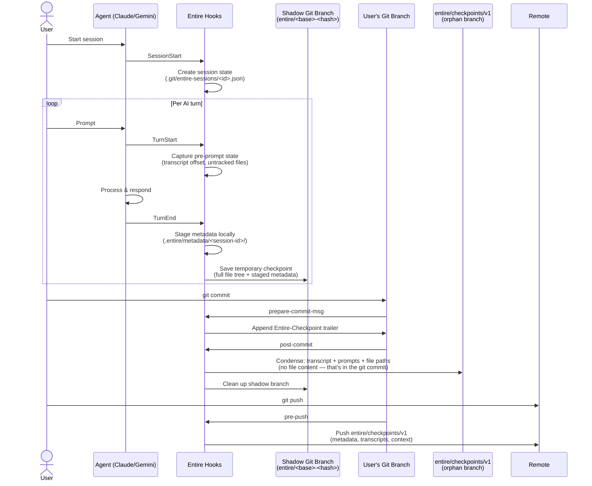

# How It Works

## Overview

Whenever you use an agent (Claude, Gemini), it creates a **session** and tracks each conversation turn via agent hooks. After each AI turn, a temporary checkpoint is saved as a full git tree snapshot (actual file content + transcript + prompts). When you commit, your commit is linked to the checkpoint via a git trailer, and the checkpoint is condensed into permanent storage — which keeps the transcript, prompts, and file paths touched, but not file content (that lives in your git commit). On push, the metadata are automatically pushed to a separate branch, for observability.

---

## Flow

### 1. Session Start

- Agent invocation triggers a `SessionStart` hook.
- A session is created with a unique ID; state is persisted at `.git/entire-sessions/<session-id>.json`.

### 2. Turn Tracking (per AI turn)

- `TurnStart` hook captures pre-prompt state: transcript position, untracked files, git status.
- `TurnEnd` hook first stages metadata locally at `.entire/metadata/<session-id>/`:
  - `full.jsonl` — transcript copy up to this turn
  - `prompt.txt` — extracted user prompts
  - `context.md` — generated context
- Then creates a **temporary checkpoint** on a shadow git branch (`entire/<base-commit>-<work-tree-hash>`), containing:
  - Full git tree snapshot (actual file content at that moment)
  - The metadata directory above, referenced via an `Entire-Metadata` trailer on the shadow commit

### 3. Git Commit → Checkpoint Finalization

- `prepare-commit-msg` hook appends an `Entire-Checkpoint: <12-hex-id>` trailer to the commit message, linking the commit to the checkpoint.
- `post-commit` hook **condenses** the temporary shadow branch checkpoint into permanent storage on the `entire/checkpoints/v1` orphan branch:
  - Transcript, prompts, and context are copied as files
  - Only file **paths** are stored (not content) — the actual changes live in the git commit
  - Attribution metrics (agent vs. human line counts) are calculated by diffing the shadow branch against the committed tree

> The checkpoint is **created at TurnEnd**, not at commit time. Committing **links and finalizes** it.

### 4. Git Push → Metadata Sync

- `pre-push` hook automatically pushes the `entire/checkpoints/v1` orphan branch alongside the user's push.
- This branch is append-only and sharded by checkpoint ID for conflict-free merges.
- Purpose: observability — the full AI session history is available on the remote.

---

## Diagram

