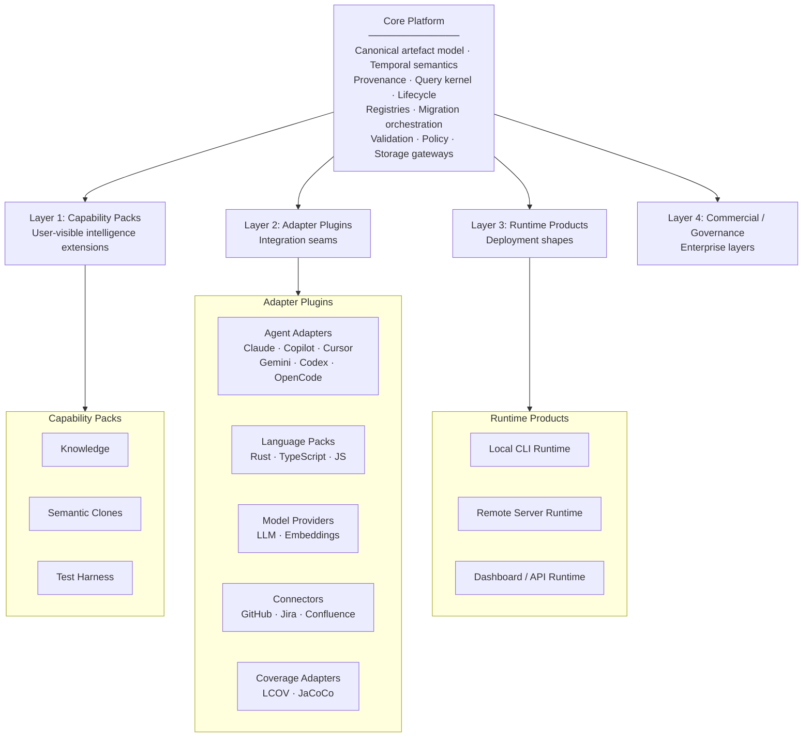
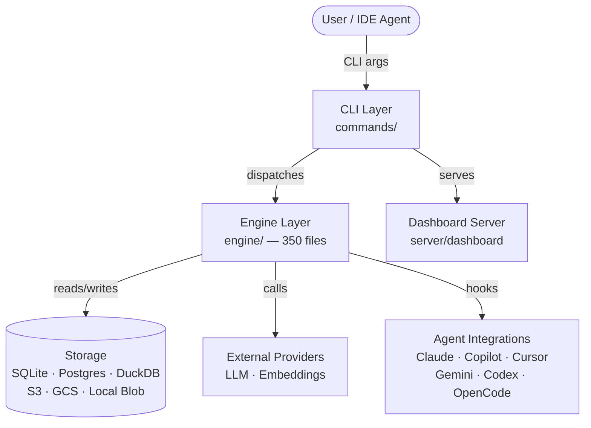
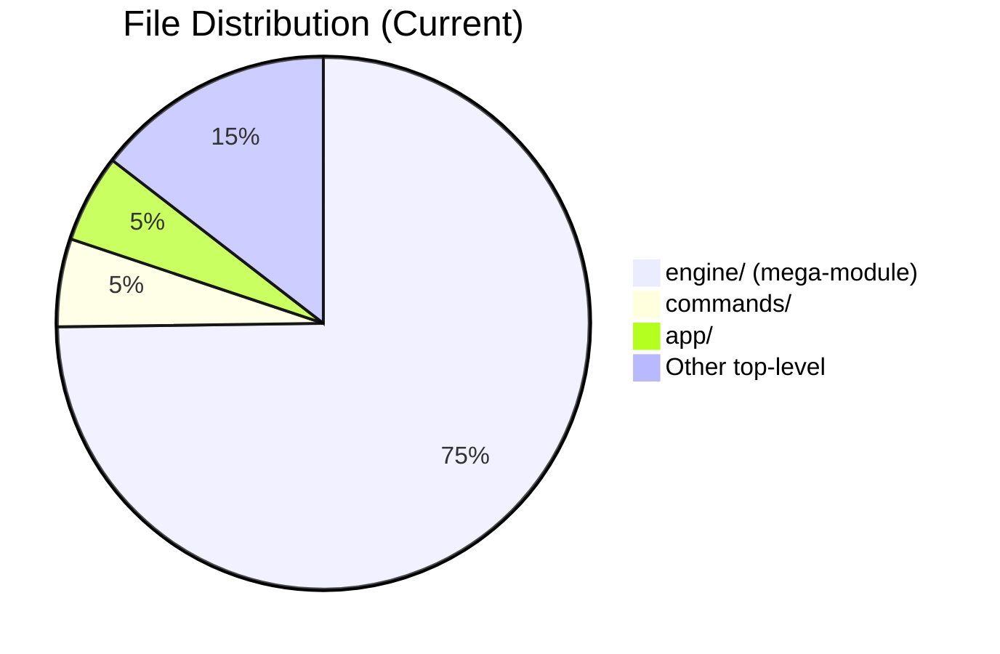
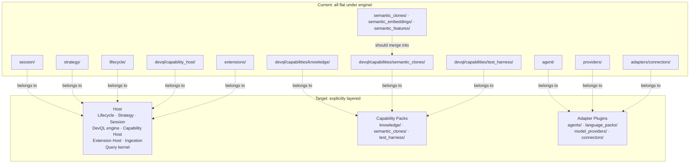
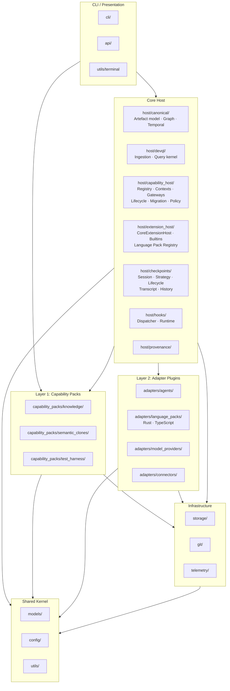
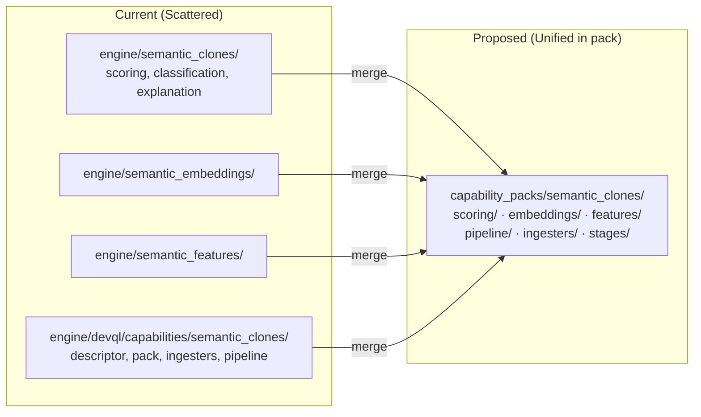

# Bitloops CLI — Architecture & Structure Review

> **Status:** Historical planning document archived after the CLI-1426 restructure. Use `documentation/contributors/architecture/` for the current architecture set.

> **Purpose**: Analyze the current folder structure and architecture against the target **Layered Extension Architecture** (as defined in CLI-1426 and referenced Confluence documents), identify gaps, and propose a restructured layout aligned with the vision.

---

## Table of Contents

1. [Target Architecture Summary](#1-target-architecture-summary)
2. [Current State Assessment](#2-current-state-assessment)
3. [Current Folder Structure](#3-current-folder-structure)
4. [Gaps: Current vs Target](#4-gaps-current-vs-target)
5. [Proposed Folder Structure](#5-proposed-folder-structure)
6. [Detailed Recommendations](#6-detailed-recommendations)
7. [Migration Strategy](#7-migration-strategy)
8. [Decision Log (To Discuss)](#8-decision-log-to-discuss)

---

## 1. Target Architecture Summary

The Layered Extension Architecture (from the Confluence docs) defines four extension layers on top of a Core Platform:



### What Core Must Own

From the architecture docs, Core is responsible for:

- Canonical artefact & symbol model
- Temporal semantics (repo/ref/as-of, commit-addressable truth)
- Provenance model
- Query parse / validate / plan / execute pipeline
- Stage & ingester registry infrastructure (the `CapabilityRegistrar`)
- Capability-pack lifecycle orchestration (discovery → validation → registration → migration → readiness → execution → observability)
- Storage gateways and migration orchestration
- Operation-specific host contexts (`CapabilityExecutionContext`, `CapabilityIngestContext`, `CapabilityMigrationContext`, `CapabilityHealthContext`)
- Policy / enablement / entitlement hooks
- Extension API versioning discipline
- Foundational built-ins (Blast Radius, dependency graph, base schema/discovery)

### What Capability Packs Own

Each pack (Knowledge, Semantic Clones, Test Harness) owns:

- Pack descriptor and metadata
- Pack-specific stages, ingesters, enrichers
- Pack-specific scoring / ranking / inference logic
- Pack-specific schema / discoverability metadata
- Pack-specific storage layout within host-approved namespaces
- Pack-specific migrations through host APIs
- Pack-specific health checks

### What Adapter Plugins Own

Each adapter family translates between Bitloops' internal contracts and external ecosystems:

- **Agent Adapters**: IDE/agent-specific hook handling, transcript parsing, session management
- **Language Packs**: Parsing, artefact extraction, symbol modeling, test discovery conventions
- **Model Providers**: LLM and embedding provider transport, auth, capability metadata
- **Connectors**: External system fetch/normalize (GitHub, Jira, Confluence)
- **Coverage Adapters**: Coverage format parsing (LCOV, JaCoCo, etc.)

---

## 2. Current State Assessment

**Scale**: ~468 `.rs` files, ~133K lines in `src/`, 1,695 test functions, Rust edition 2024.

### Current High-Level Data Flow



### What Already Aligns With The Target Architecture

The codebase has made meaningful progress toward the layered vision:

1. **Agent Adapters** are formalized with host-managed registration, validation, compatibility, readiness, and resolution (`engine/agent/adapters/`, `engine/agent/canonical/`)
2. **Capability Pack host** exists with real `CapabilityPack` trait, `CapabilityRegistrar`, `CapabilityDescriptor`, host contexts, gateways, lifecycle, policy, and migration orchestration (`engine/devql/capability_host/`)
3. **Three first-party packs** (Knowledge, Semantic Clones, Test Harness) are already partially extracted under `engine/devql/capabilities/`
4. **Language Pack registry** exists with descriptors and resolution (`engine/extensions/language/`)
5. **CoreExtensionHost** bootstraps language packs and capability packs (`engine/extensions/host/`)

### What Does Not Yet Align

Despite the progress, the **folder structure does not make the architecture obvious**:



---

## 3. Current Folder Structure

```
src/
├── main.rs
├── lib.rs                           # 12 pub mod declarations
├── branding.rs
│
├── app/                             # Test mapping (overlaps with test_harness cap pack)
│   ├── commands/
│   └── test_mapping/languages/
│
├── commands/                        # CLI command handlers
├── db/                              # SQLite schema for test domain
├── domain/                          # Domain records (~50 structs in 1 file)
├── read/                            # Query view layer
├── repository/sqlite/               # TestHarness data access
├── server/dashboard/                # Dashboard HTTP server
├── store_config/                    # Configuration resolution
├── terminal/                        # Terminal UI
├── test_support/                    # Test utilities (cfg(test))
│
└── engine/                          # ⚠️ MEGA-MODULE (~350 files, 30 sub-modules)
    ├── adapters/connectors/         # Connector adapters (GitHub, Jira, Confluence)
    ├── agent/                       # Agent framework + 6 implementations + adapters + canonical
    ├── blob/                        # Blob storage (local, S3, GCS)
    ├── capability_packs/builtin/    # Built-in pack registration
    ├── db/                          # DB connections (SQLite + Postgres)
    ├── devql/                       # ⚠️ SUB-MEGA (~150 files)
    │   ├── capabilities/            # 3 capability pack implementations
    │   │   ├── knowledge/           # ~30 files
    │   │   ├── semantic_clones/     # ~20 files
    │   │   └── test_harness/        # ~20 files
    │   ├── capability_host/         # Host runtime, gateways, contexts, lifecycle
    │   ├── ingestion/               # Semantic ingestion engine
    │   ├── query/                   # Query parser + executor
    │   └── tests/                   # BDD/Cucumber tests
    ├── extensions/                   # CoreExtensionHost, Language Packs, Capability Packs
    ├── hooks/                       # Hook dispatcher + runtime
    ├── lifecycle/                   # Session lifecycle orchestration
    ├── logging/                     # Logging infrastructure
    ├── paths/                       # Path resolution
    ├── providers/                   # LLM + Embedding providers
    ├── semantic_clones/             # Clone scoring algorithms (separate from cap pack!)
    ├── semantic_embeddings/         # Embedding management
    ├── semantic_features/           # Feature extraction
    ├── session/                     # Session state + backends
    ├── settings/                    # Settings management
    ├── strategy/                    # Checkpoint strategies (~80 files)
    ├── telemetry/                   # Analytics
    ├── test_harness/                # Test infrastructure (separate from cap pack!)
    ├── transcript/                  # Transcript parsing
    ├── validation/                  # Input validation
    ├── git_operations.rs            # Git utilities
    ├── stringutil.rs, textutil.rs   # String/text utilities
    └── summarize.rs, trailers.rs    # Misc utilities
```

---

## 4. Gaps: Current vs Target

### 4.1. The `engine/` Mega-Module Hides The Architecture

`engine/` contains ~350 of 468 files (75%) with 30 direct sub-modules. A newcomer looking at `src/` sees `commands/` and `engine/` — not the four-layer extension model. The architecture is buried two levels deep inside `engine/devql/capability_host/`.

### 4.2. Core, Capability Packs, and Adapters Are Not Structurally Separated

The target architecture has three distinct concerns that are currently intermingled flat under `engine/`:



### 4.3. Semantic Analysis Is Split Between Core and Pack

Clone scoring algorithms (`engine/semantic_clones/`, `engine/semantic_embeddings/`, `engine/semantic_features/`) live outside the Semantic Clones capability pack, despite the architecture docs being clear that:

> *"Core owns parser-backed structural extraction and canonical artefact identity; the Semantic Clones pack owns semantic enrichment, vectorization, hybrid scoring, and clone interpretation."*

These modules should be consolidated into the Semantic Clones capability pack.

### 4.4. Test Harness Concern Is Scattered

Test harness logic is spread across:

| Location | Content |
|---|---|
| `engine/devql/capabilities/test_harness/` | Capability pack (correct location) |
| `engine/test_harness/` | Test infrastructure (Postgres test harness — separate concern) |
| `app/test_mapping/` | Test discovery and mapping |
| `db/` | Test domain schema |
| `repository/sqlite/` | TestHarness data access |

The architecture docs say the Test Harness pack should own "test-to-artefact linkage, coverage mapping, classification, scoring, verification summaries." The `app/` and `repository/` content should merge into the capability pack. `engine/test_harness/` (Postgres test infra) is a different concern entirely — it's test tooling, not the Test Harness capability.

### 4.5. Dual Database Layer

- `src/db/` — SQLite schema for test domain
- `src/engine/db/` — Connection pooling for checkpoint databases

Both are Core infrastructure but live in separate, confusing locations.

### 4.6. `app/` Module Is Misplaced

`app/` contains test mapping logic that belongs in the Test Harness capability pack, not as a top-level module.

### 4.7. Adapters Are Not Grouped As A Family

Agent adapters, model providers, and connectors are each separate `engine/` sub-modules. The architecture defines these as subcategories of the same **Adapter Plugins** layer. Grouping them makes the taxonomy visible.

### 4.8. Utility Sprawl in `engine/`

Loose utility files at the `engine/` root (`stringutil.rs`, `textutil.rs`, `summarize.rs`, `trailers.rs`, `db_status.rs`, `git_operations.rs`) don't belong to any subsystem. These are cross-cutting concerns that should live in a shared utilities module.

---

## 5. Proposed Folder Structure

### Module Naming Convention: Modern Rust Idiom

The codebase currently mixes legacy `mod.rs` style (73 instances) with the modern sibling-file pattern (~21 instances). **All new and moved modules should use the modern Rust 2018+ convention:**

```rust
// LEGACY (avoid):           MODERN (preferred):
// foo/                      foo.rs          ← module root (declares sub-modules)
//   mod.rs                  foo/            ← directory for child modules
//   bar.rs                    bar.rs
//   baz.rs                    baz.rs
```

The key difference: instead of `foo/mod.rs` containing the module root, you have `foo.rs` as a **sibling file** next to the `foo/` directory. The `foo.rs` file declares `mod bar; mod baz;` and the implementations live in `foo/bar.rs` and `foo/baz.rs`.

**Why this matters:**
- Avoids having dozens of tabs named `mod.rs` in your editor
- Each file has a unique name that reflects its module path
- This is the convention used by the Rust compiler itself, Cargo, and most modern Rust projects
- Existing `mod.rs` files should be migrated opportunistically (rename `foo/mod.rs` → `foo.rs` + keep `foo/` for children)

### Proposed Structure

The structure should make the four layers of the architecture visible at the top level of `src/`:

```
src/
├── main.rs
├── lib.rs
│
│── ─── ─── CLI / PRESENTATION ─── ─── ──
│
├── cli.rs                               # Module root: Cli struct, Commands enum, run()
├── cli/                                 # CLI command handlers
│   ├── root.rs                          #   Help, version, post-run hooks
│   ├── branding.rs                      #   ASCII art, wordmark
│   ├── init.rs                          #   Init command + sub-steps
│   ├── init/                            #   Init sub-modules
│   │   ├── agent_hooks.rs
│   │   ├── agent_selection.rs
│   │   ├── store_backends.rs
│   │   └── telemetry.rs
│   ├── enable.rs
│   ├── status.rs
│   ├── rewind.rs
│   ├── resume.rs
│   ├── reset.rs
│   ├── clean.rs
│   ├── explain.rs                       #   Explain module root
│   ├── explain/                         #   Explain sub-commands
│   │   ├── branch.rs
│   │   └── commit.rs
│   ├── devql.rs                         #   DevQL CLI entry point
│   ├── testlens.rs
│   ├── dashboard.rs
│   ├── doctor.rs
│   └── debug.rs
│
├── api.rs                               # Module root: HTTP API server
├── api/
│   ├── router.rs                        #   Route definitions
│   ├── handlers.rs                      #   Request handlers
│   ├── dto.rs                           #   Data transfer objects
│   └── dashboard_bundle.rs              #   Dashboard UI bundle serving
│
│
│── ─── ─── CORE HOST ─── ─── ──
│
├── host.rs                              # Module root: re-exports Core Host sub-modules
├── host/
│   │
│   ├── canonical.rs                     # Module root: canonical artefact & symbol model
│   ├── canonical/
│   │   ├── artefact.rs
│   │   ├── graph.rs                     #   Canonical dependency graph contracts
│   │   └── temporal.rs                  #   Repo/ref/as-of semantics
│   │
│   ├── devql.rs                         # Module root: RepoIdentity, DevqlConfig
│   ├── devql/
│   │   ├── identity.rs
│   │   ├── ingestion.rs                 #   Module root: Core structural extraction
│   │   ├── ingestion/
│   │   │   ├── schema.rs
│   │   │   ├── schema/                  #   Schema sub-modules if needed
│   │   │   └── extractors.rs
│   │   ├── query.rs                     #   Module root: Query parser & executor
│   │   ├── query/
│   │   │   ├── parser.rs
│   │   │   └── executor.rs
│   │   ├── watch.rs
│   │   └── vocab.rs
│   │
│   ├── capability_host.rs               # Module root: DevqlCapabilityHost
│   ├── capability_host/
│   │   ├── registrar.rs                 #   CapabilityRegistrar trait
│   │   ├── descriptors.rs               #   CapabilityDescriptor, CapabilityPackDescriptor
│   │   ├── lifecycle.rs                 #   Discovery → validation → registration → ...
│   │   ├── policy.rs                    #   HostInvocationPolicy, CrossPackAccessPolicy
│   │   ├── migrations.rs                #   MigrationRunner, CapabilityMigration
│   │   ├── health.rs                    #   CapabilityHealthCheck
│   │   ├── composition.rs               #   Pack composition rules
│   │   ├── contexts.rs                  #   Module root: operation-specific host contexts
│   │   ├── contexts/
│   │   │   ├── execution.rs             #     CapabilityExecutionContext
│   │   │   ├── ingest.rs                #     CapabilityIngestContext
│   │   │   ├── migration.rs             #     CapabilityMigrationContext
│   │   │   └── health.rs                #     CapabilityHealthContext
│   │   ├── gateways.rs                  #   Module root: host-owned storage gateways
│   │   └── gateways/
│   │       ├── relational.rs            #     RelationalGateway
│   │       ├── documents.rs             #     DocumentStoreGateway
│   │       └── blob_payload.rs          #     BlobPayloadGateway
│   │
│   ├── extension_host.rs               # Module root: CoreExtensionHost
│   ├── extension_host/
│   │   ├── builtins.rs                  #   Built-in language & capability packs
│   │   ├── readiness.rs
│   │   └── error.rs
│   │
│   ├── checkpoints.rs                   # Module root: session & checkpoint management
│   ├── checkpoints/
│   │   ├── session.rs                   #   Module root: state, backends, phases
│   │   ├── session/
│   │   │   ├── backend.rs               #     SessionBackend trait
│   │   │   ├── db_backend.rs            #     Postgres implementation
│   │   │   └── state.rs                 #     SessionState, Phase
│   │   ├── strategy.rs                  #   Module root: checkpoint strategies
│   │   ├── strategy/
│   │   │   ├── registry.rs
│   │   │   ├── manual_commit.rs         #     Module root for manual commit (~40 files)
│   │   │   ├── manual_commit/           #     Manual commit sub-modules
│   │   │   ├── auto_commit.rs
│   │   │   └── noop.rs
│   │   ├── lifecycle.rs                 #   Module root: session lifecycle orchestration
│   │   ├── lifecycle/
│   │   │   ├── orchestration.rs
│   │   │   └── adapters.rs
│   │   ├── transcript.rs                #   Module root: transcript parsing
│   │   ├── transcript/
│   │   │   ├── parse.rs
│   │   │   ├── io.rs
│   │   │   └── metadata.rs
│   │   ├── attribution.rs
│   │   ├── redact.rs
│   │   └── history.rs
│   │
│   ├── hooks.rs                         # Module root: hook dispatcher & runtime
│   ├── hooks/
│   │   ├── dispatcher.rs
│   │   ├── git.rs
│   │   ├── runtime.rs
│   │   └── runtime/
│   │       └── agent_runtime.rs
│   │
│   ├── provenance.rs                    # Provenance model (leaf or module root)
│   │
│   └── validation.rs                    # Input validation (leaf module)
│
│── ─── ─── LAYER 1: CAPABILITY PACKS ─── ─── ──
│
├── capability_packs.rs                  # Module root: re-exports, built-in pack list
├── capability_packs/
│   │
│   ├── knowledge.rs                     # Module root: Knowledge Capability Pack
│   ├── knowledge/
│   │   ├── descriptor.rs                #   KNOWLEDGE_DESCRIPTOR
│   │   ├── pack.rs                      #   impl CapabilityPack for KnowledgePack
│   │   ├── stages.rs                    #   Module root: knowledge() query stage
│   │   ├── stages/                      #   Stage sub-modules if needed
│   │   ├── ingesters.rs                 #   Module root: knowledge.add, knowledge.refresh
│   │   ├── ingesters/
│   │   │   ├── add.rs
│   │   │   └── refresh.rs
│   │   ├── services.rs                  #   Ingestion orchestration logic
│   │   ├── providers.rs                 #   Module root: source-specific fetch helpers
│   │   ├── providers/
│   │   ├── storage.rs                   #   Module root: pack-namespaced storage
│   │   ├── storage/
│   │   │   ├── sqlite.rs
│   │   │   ├── duckdb.rs
│   │   │   └── blob.rs
│   │   ├── migrations.rs                #   Pack-scoped migrations
│   │   ├── health.rs                    #   Pack health checks
│   │   ├── schema.rs                    #   Schema/discoverability metadata
│   │   ├── cli.rs                       #   CLI entry points (knowledge add, etc.)
│   │   └── plugin.rs                    #   Provenance plugin
│   │
│   ├── semantic_clones.rs               # Module root: Semantic Clones Capability Pack
│   ├── semantic_clones/
│   │   ├── descriptor.rs                #   SEMANTIC_CLONES_DESCRIPTOR
│   │   ├── pack.rs                      #   impl CapabilityPack for SemanticClonesPack
│   │   ├── stages.rs                    #   Module root: semanticClones() query stage
│   │   ├── ingesters.rs                 #   Module root: rebuild_semantic_features
│   │   ├── pipeline.rs                  #   Module root: enrichment pipeline
│   │   ├── pipeline/
│   │   │   ├── semantics.rs             #     Stage 1: semantic summaries + features
│   │   │   ├── embeddings.rs            #     Stage 2: embedding generation
│   │   │   └── clone_edges.rs           #     Stage 3: clone edge generation
│   │   ├── scoring.rs                   #   Module root: hybrid scoring
│   │   ├── scoring/
│   │   │   ├── classification.rs
│   │   │   └── explanation.rs
│   │   ├── features.rs                  #   Semantic feature extraction (pack-owned)
│   │   ├── storage.rs
│   │   ├── migrations.rs
│   │   ├── health.rs
│   │   └── schema.rs
│   │
│   ├── test_harness.rs                  # Module root: Test Harness Capability Pack
│   └── test_harness/
│       ├── descriptor.rs                #   TEST_HARNESS_DESCRIPTOR
│       ├── pack.rs                      #   impl CapabilityPack for TestHarnessPack
│       ├── stages.rs                    #   Module root: tests(), summary(), coverage()
│       ├── ingesters.rs                 #   Module root: linkage, coverage, classification
│       ├── mapping.rs                   #   Module root: test-to-artefact linkage
│       ├── mapping/
│       │   ├── discovery.rs
│       │   ├── linking.rs
│       │   └── materialization.rs
│       ├── languages.rs                 #   Module root: language-specific test parsers
│       ├── languages/
│       │   ├── rust.rs
│       │   └── typescript.rs
│       ├── coverage.rs                  #   Coverage ingestion & interpretation
│       ├── classification.rs            #   Test classification logic
│       ├── repository.rs                #   Module root: pack data access
│       ├── repository/
│       │   └── sqlite.rs
│       ├── storage.rs
│       ├── migrations.rs
│       ├── health.rs
│       └── schema.rs
│
│── ─── ─── LAYER 2: ADAPTER PLUGINS ─── ─── ──
│
├── adapters.rs                          # Module root: integration seams
├── adapters/
│   │
│   ├── agents.rs                        # Module root: Agent trait, HookSupport trait
│   ├── agents/
│   │   ├── registry.rs                  #   Agent registry
│   │   ├── types.rs                     #   HookType, TokenUsage, Event
│   │   ├── canonical.rs                 #   Module root: host-owned canonical types
│   │   ├── canonical/
│   │   │   └── ...
│   │   ├── adapter_layer.rs             #   Module root: compatibility, config, descriptor
│   │   ├── adapter_layer/
│   │   │   └── ...
│   │   ├── claude_code.rs               #   Module root: Claude Code implementation
│   │   ├── claude_code/
│   │   │   └── ...
│   │   ├── copilot.rs                   #   GitHub Copilot
│   │   ├── copilot/
│   │   ├── cursor.rs                    #   Cursor IDE
│   │   ├── cursor/
│   │   ├── codex.rs                     #   OpenAI Codex
│   │   ├── codex/
│   │   ├── gemini.rs                    #   Google Gemini
│   │   ├── gemini/
│   │   ├── open_code.rs                 #   OpenCode
│   │   └── open_code/
│   │
│   ├── language_packs.rs                # Module root: Language Pack adapter family
│   ├── language_packs/
│   │   ├── descriptors.rs               #   Language descriptors
│   │   ├── rust_pack.rs                 #   Rust first-party pack (module root)
│   │   ├── rust_pack/
│   │   │   └── ...                      #     Rust-specific parsing, extraction, test discovery
│   │   ├── typescript_pack.rs           #   TypeScript/JS first-party pack (module root)
│   │   └── typescript_pack/
│   │       └── ...                      #     TS/JS-specific parsing, extraction, test discovery
│   │
│   ├── model_providers.rs               # Module root: factory functions
│   ├── model_providers/
│   │   ├── llm.rs                       #   Module root: LlmProvider trait
│   │   ├── llm/
│   │   │   └── http.rs                  #     HTTP chat-completion client
│   │   ├── embeddings.rs                #   Module root: EmbeddingProvider trait
│   │   └── embeddings/
│   │       ├── local.rs                 #     Local (Jina)
│   │       └── http.rs                  #     HTTP (Voyage, OpenAI)
│   │
│   ├── connectors.rs                    # Module root: KnowledgeConnectorAdapter trait
│   └── connectors/
│       ├── github.rs
│       ├── jira.rs
│       └── confluence.rs
│
│── ─── ─── INFRASTRUCTURE ─── ─── ──
│
├── storage.rs                           # Module root: re-exports storage backends
├── storage/
│   ├── sqlite.rs                        #   Module root: SQLite connections, pools
│   ├── sqlite/
│   │   ├── pool.rs
│   │   └── schema.rs
│   ├── postgres.rs                      #   PostgreSQL connections
│   ├── duckdb.rs                        #   DuckDB document storage
│   ├── blob.rs                          #   Module root: BlobStore trait
│   ├── blob/
│   │   ├── local.rs
│   │   ├── s3.rs
│   │   └── gcs.rs
│   └── connections.rs                   #   CheckpointDbConnections
│
├── git.rs                               # Git operations (leaf or module root)
├── git/
│   └── hooks.rs                         #   Git hook file management
│
├── telemetry.rs                         # Module root: analytics (PostHog)
├── telemetry/
│   └── logging.rs                       #   Module root: file-based structured logging
│       logging/
│       ├── context.rs
│       └── logger.rs
│
│── ─── ─── SHARED KERNEL ─── ─── ──
│
├── models.rs                            # Module root: re-exports all domain models
├── models/
│   ├── repository.rs                    #   RepositoryRecord, CommitRecord
│   ├── artefact.rs                      #   ProductionArtefactRecord, edges
│   ├── test.rs                          #   TestSuiteRecord, TestRunRecord
│   ├── coverage.rs                      #   CoverageCapture, CoverageHit
│   └── classification.rs               #   TestClassificationRecord
│
├── config.rs                            # Module root: configuration & settings
├── config/
│   ├── settings.rs                      #   BitloopsSettings (merge base + local)
│   ├── store_config.rs                  #   StoreBackendConfig resolution
│   ├── resolve.rs                       #   Env → file → defaults
│   └── constants.rs
│
├── utils.rs                             # Module root: cross-cutting utilities
└── utils/
    ├── strings.rs                       #   collapse_whitespace, truncate
    ├── text.rs                          #   Text processing
    ├── paths.rs                         #   Path resolution, is_protected
    └── terminal.rs                      #   TUI formatting (db_status_table, etc.)
```

### How This Maps To The Four Layers



---

## 6. Detailed Recommendations

### 6.1. Introduce `host/` As The Core Host Substrate

**Priority: HIGH**

Replace the flat `engine/` mega-module with a `host/` module that contains only what the architecture says Core Host must own (avoiding `core/` to prevent confusion with Rust's `libcore`). This is the single most impactful structural change.

| Current `engine/` sub-module | Destination | Rationale |
|---|---|---|
| `devql/capability_host/` | `host/capability_host/` | Registry, contexts, gateways are Core |
| `devql/ingestion/` | `host/devql/ingestion/` | Structural extraction is Core substrate |
| `devql/query/` | `host/devql/query/` | Query kernel is Core |
| `extensions/` | `host/extension_host/` | Extension bootstrapping is Core |
| `session/` | `host/checkpoints/session/` | Session management is Core lifecycle |
| `strategy/` | `host/checkpoints/strategy/` | Checkpoint strategy is Core lifecycle |
| `lifecycle/` | `host/checkpoints/lifecycle/` | Lifecycle orchestration is Core |
| `transcript/` | `host/checkpoints/transcript/` | Transcript data serves checkpoints |
| `history/` | `host/checkpoints/history.rs` | Session history is Core |
| `hooks/` | `host/hooks/` | Hook dispatch is Core orchestration |
| `validation/` | `host/validation/` | Input validation is Core |

### 6.2. Create `capability_packs/` As A Distinct Top-Level Module

**Priority: HIGH**

Move capability pack implementations out of `engine/devql/capabilities/` to a top-level `capability_packs/` that makes the Capability Pack layer architecturally visible.

| Current | Destination |
|---|---|
| `engine/devql/capabilities/knowledge/` | `capability_packs/knowledge/` |
| `engine/devql/capabilities/semantic_clones/` | `capability_packs/semantic_clones/` |
| `engine/devql/capabilities/test_harness/` | `capability_packs/test_harness/` |

### 6.3. Consolidate Semantic Analysis Into The Semantic Clones Pack

**Priority: HIGH**

The architecture docs are explicit: *"the Semantic Clones pack owns semantic enrichment, vectorization, hybrid scoring, and clone interpretation."* The standalone `engine/semantic_*` modules should merge into the pack:



### 6.4. Consolidate Test Harness Into The Test Harness Pack

**Priority: MEDIUM**

Merge scattered test harness logic into the capability pack:

| Current | Destination | Notes |
|---|---|---|
| `app/test_mapping/` | `capability_packs/test_harness/mapping/` | Test discovery/linking is pack-owned |
| `app/test_mapping/languages/` | `capability_packs/test_harness/languages/` | Language-specific test parsers |
| `repository/sqlite/` | `capability_packs/test_harness/repository/` | Pack data access |
| `db/` (test domain schema) | `capability_packs/test_harness/storage/` or `capability_packs/test_harness/migrations/` | Pack-scoped schema |
| `engine/test_harness/` | `host/` or keep for test infra | This is Postgres test *tooling*, not the capability pack |

### 6.5. Create `adapters/` To Group All Adapter Families

**Priority: MEDIUM**

The Language Pack *registry* stays in `host/extension_host/` (host-owned), while *implementations* live under `adapters/language_packs/`.

| Current | Destination |
| --- | --- |
| `engine/extensions/language/` (registry) | `host/extension_host/` (registry stays host-owned) |
| Language pack implementations | `adapters/language_packs/` |
| `engine/agent/` | `adapters/agents/` |
| `engine/providers/` | `adapters/model_providers/` |
| `engine/adapters/connectors/` | `adapters/connectors/` |

### 6.6. Unify Storage Infrastructure

**Priority: MEDIUM**

Merge `src/db/` and `engine/db/` into `storage/`:

| Current | Destination |
|---|---|
| `engine/db/` (connections) | `storage/connections.rs` |
| `engine/db/sqlite.rs` | `storage/sqlite/` |
| `engine/db/postgres.rs` | `storage/postgres/` |
| `engine/blob/` | `storage/blob/` |

### 6.7. Merge Configuration Modules

**Priority: LOW**

Merge `store_config/` and `engine/settings/` into `config/`:

| Current | Destination |
|---|---|
| `store_config/` | `config/store_config.rs`, `config/resolve.rs` |
| `engine/settings/` | `config/settings.rs` |

### 6.8. Extract Shared Utilities

**Priority: LOW**

| Current | Destination |
|---|---|
| `engine/stringutil.rs` | `utils/strings.rs` |
| `engine/textutil.rs` | `utils/text.rs` |
| `engine/paths/` | `utils/paths.rs` |
| `engine/validation/` | `host/validation/` or `utils/validation.rs` |
| `engine/git_operations.rs` | `git.rs` |
| `branding.rs` | `cli/branding.rs` |

### 6.9. Migrate Existing `mod.rs` Files To Modern Sibling Style

**Priority: LOW (opportunistic during moves)**

The codebase has 73 `mod.rs` files using the legacy convention. When a module is being moved as part of the restructuring, convert it to the modern style in the same commit:

```bash
# Example: converting engine/session/mod.rs → host/checkpoints/session.rs
git mv engine/session/mod.rs host/checkpoints/session.rs
# Children stay in host/checkpoints/session/
git mv engine/session/backend.rs host/checkpoints/session/backend.rs
git mv engine/session/state.rs host/checkpoints/session/state.rs
```

For modules that are NOT being moved, convert opportunistically in separate low-risk PRs. The mechanical change is: rename `foo/mod.rs` → `foo.rs` (sibling to `foo/` directory). No code changes needed — Rust resolves both styles identically.

### 6.10. Split Domain Model

**Priority: LOW**

`domain/mod.rs` has ~50 record structs in one file. Split by aggregate root into `models/`:

- `models/repository.rs` — RepositoryRecord, CommitRecord, FileStateRecord
- `models/artefact.rs` — ProductionArtefactRecord, ProductionEdgeRecord
- `models/test.rs` — TestSuiteRecord, TestScenarioRecord, TestRunRecord
- `models/coverage.rs` — CoverageCaptureRecord, CoverageHitRecord
- `models/classification.rs` — TestClassificationRecord

---

## 7. Migration Strategy

### Phased Approach

```mermaid
gantt
    title Migration Phases
    dateFormat X
    axisFormat %s

    section Phase 1 — Shared Kernel
    utils/ (paths, stringutil, validation)          :a1, 0, 1
    models/ (split domain/)                         :a2, 0, 1
    config/ (settings + store_config)               :a3, 0, 1
    git/ (git_operations)                           :a4, 0, 1
    telemetry/ (logging + telemetry)                :a5, 0, 1

    section Phase 2 — Infrastructure
    storage/ (merge db + blob)                      :b1, 1, 2

    section Phase 3 — Adapter Plugins
    adapters/agents/ (move agent/)                  :c1, 2, 3
    adapters/model_providers/ (move providers/)     :c2, 2, 3
    adapters/connectors/ (move connectors/)         :c3, 2, 3
    adapters/language_packs/ (move lang pack impls)  :c4, 2, 3

    section Phase 4 — Capability Packs
    capability_packs/knowledge/                     :d1, 3, 4
    capability_packs/semantic_clones/ (+ merge)     :d2, 3, 4
    capability_packs/test_harness/ (+ merge app/)   :d3, 3, 4

    section Phase 5 — Core Host
    host/capability_host/                           :e1, 4, 5
    host/extension_host/                            :e2, 4, 5
    host/devql/ (ingestion + query)                 :e3, 4, 5
    host/checkpoints/ (session + strategy + ...)    :e4, 4, 5
    host/hooks/                                     :e5, 4, 5

    section Phase 6 — CLI Rename
    cli/ (rename commands/)                         :f1, 5, 6
    dashboard/ (move server/)                       :f2, 5, 6
```



### Mechanical Steps Per Module Move

1. Create new module directory and `mod.rs`
2. Move files with `git mv` (preserves history)
3. Update `use` paths crate-wide (bulk find-and-replace)
4. Update `lib.rs` module declarations
5. Run `cargo check` to catch all path issues
6. Run full test suite
7. Single commit per module move

### Risk Mitigation

- **One module per PR** — keeps diffs reviewable
- **No logic changes during moves** — pure structural refactoring
- **CI must pass** — all 1,695 tests green before merge

---

## 8. Decision Log (Resolved)

| # | Decision | Resolution |
| --- | --- | --- |
| 1 | **Single Crate vs. Workspace** | Single crate for now. Restructure modules first; workspace split is a future step after boundaries are clean. |
| 2 | **Top-level module name** | **`host/`** — avoids confusion with Rust's `libcore`. Matches "Core Host" from the architecture docs. |
| 3 | **Hooks placement** | **`host/hooks/`** — hooks are Core orchestration that dispatches to agents, not agent-owned infrastructure. |
| 4 | **Language Pack registry vs implementations** | Registry stays in **`host/extension_host/`** (host-owned). Pack implementations (Rust, TS) live in **`adapters/language_packs/`**. |
| 5 | **Capability Packs location** | **`capability_packs/`** at top level — makes Layer 1 visible at `src/`. Host machinery stays in `host/capability_host/`. |
| 6 | **Test location strategy** | Inline `#[cfg(test)] mod tests {}` for unit tests. Integration tests under `tests/` folder. No sibling `_tests.rs` files. BDD/Cucumber tests co-located with their module. |
| 7 | **Postgres test tooling vs Test Harness pack** | `engine/test_harness/postgres/` is test infrastructure tooling → move to `test_support/postgres/`. Clearly distinct from the Test Harness capability pack in `capability_packs/test_harness/`. |

---

## Appendix: Module Mapping Summary

| Layer | Current Location | Proposed Location |
| --- | --- | --- |
| **CLI** | `commands/` | `cli.rs` + `cli/` |
| **API** | `server/dashboard/` | `api.rs` + `api/` |
| **Terminal** | `terminal/` | `utils/terminal.rs` |
| **Host: Capability Host** | `engine/devql/capability_host/` | `host/capability_host.rs` + `host/capability_host/` |
| **Host: Extension Host** | `engine/extensions/` | `host/extension_host.rs` + `host/extension_host/` |
| **Host: DevQL Engine** | `engine/devql/{ingestion,query,identity,...}` | `host/devql.rs` + `host/devql/` |
| **Host: Checkpoints** | `engine/{session,strategy,lifecycle,transcript,history}` | `host/checkpoints.rs` + `host/checkpoints/` |
| **Host: Hooks** | `engine/hooks/` | `host/hooks.rs` + `host/hooks/` |
| **Pack: Knowledge** | `engine/devql/capabilities/knowledge/` | `capability_packs/knowledge.rs` + `capability_packs/knowledge/` |
| **Pack: Semantic Clones** | `engine/devql/capabilities/semantic_clones/` + `engine/semantic_*` | `capability_packs/semantic_clones.rs` + `capability_packs/semantic_clones/` |
| **Pack: Test Harness** | `engine/devql/capabilities/test_harness/` + `app/` + `repository/` + `db/` | `capability_packs/test_harness.rs` + `capability_packs/test_harness/` |
| **Adapter: Language Packs** | `engine/extensions/language/` (implementations) | `adapters/language_packs.rs` + `adapters/language_packs/` |
| **Adapter: Agents** | `engine/agent/` | `adapters/agents.rs` + `adapters/agents/` |
| **Adapter: Model Providers** | `engine/providers/` | `adapters/model_providers.rs` + `adapters/model_providers/` |
| **Adapter: Connectors** | `engine/adapters/connectors/` | `adapters/connectors.rs` + `adapters/connectors/` |
| **Infra: Storage** | `db/` + `engine/db/` + `engine/blob/` | `storage.rs` + `storage/` |
| **Infra: Git** | `engine/git_operations*` | `git.rs` + `git/` |
| **Infra: Telemetry** | `engine/{telemetry,logging}` | `telemetry.rs` + `telemetry/` |
| **Shared: Models** | `domain/` | `models.rs` + `models/` |
| **Shared: Config** | `store_config/` + `engine/settings/` | `config.rs` + `config/` |
| **Shared: Utils** | `engine/{stringutil,textutil,paths}` + `branding.rs` | `utils.rs` + `utils/` + `cli/branding.rs` |
| **Test Support** | `test_support/` + `engine/test_harness/postgres/` | `test_support.rs` + `test_support/` |

**Result**: Top-level `src/` goes from 12 opaque modules to ~14 architecture-aligned modules, with the four-layer extension model visible at a glance. Every module uses the modern Rust sibling-file convention (`name.rs` + `name/`).
