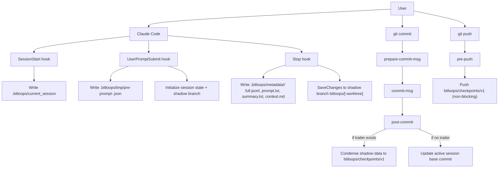
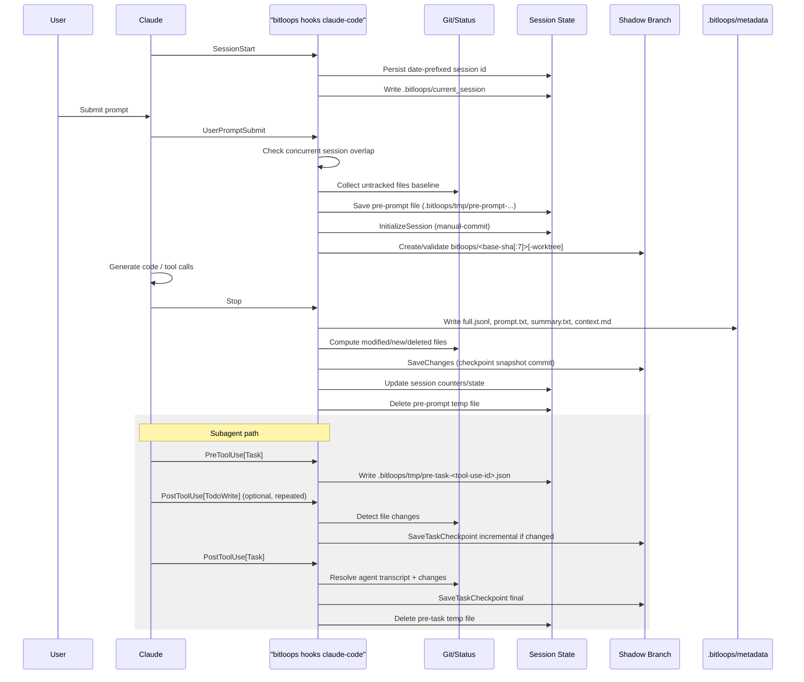
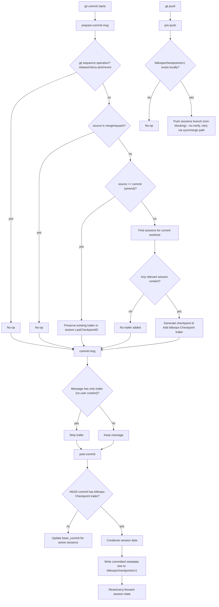
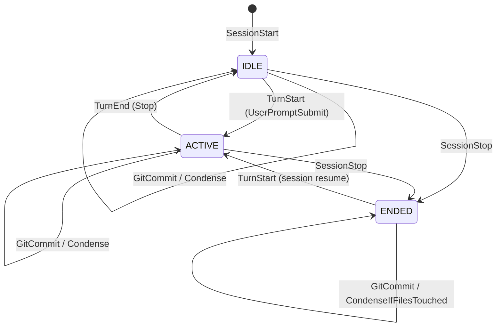

# Rust Reference: Claude + Git Hooks Flow

This document captures the **Rust reference** hook lifecycle for Claude sessions and git commits.

- Claude metadata/storage names in Rust reference: `.bitloops/...`
- Temporary branch in Rust reference: `bitloops/<base-sha[:7]>[-worktree]`
- Committed metadata branch in Rust reference: `bitloops/checkpoints/v1`

## 1) End-to-End Flow (Claude + Git)

## 2) Claude Hook Sequence

## 3) Git Hook Decision Flow (Manual-Commit)

## 4) Session Phase State Machine

