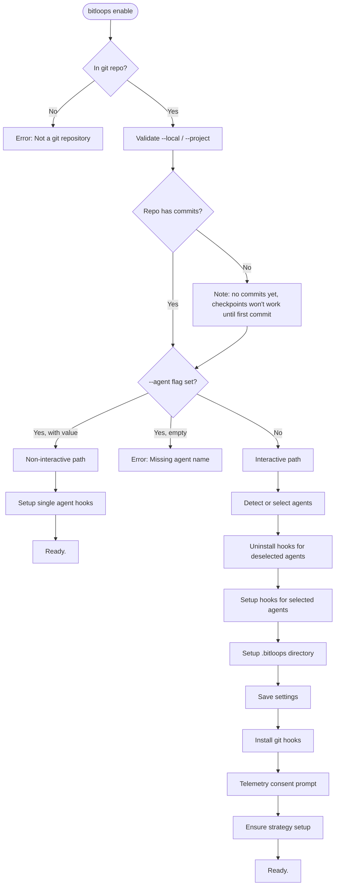
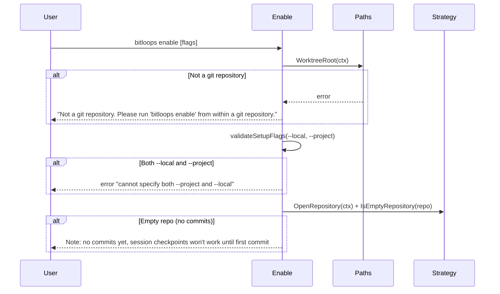
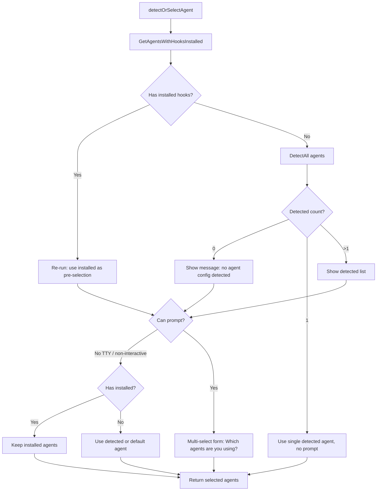
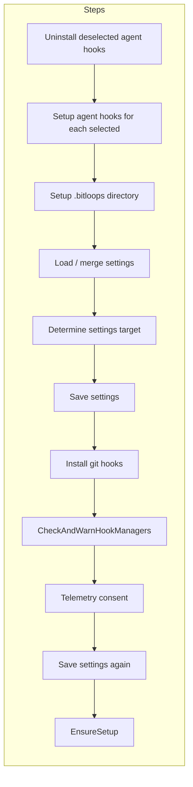
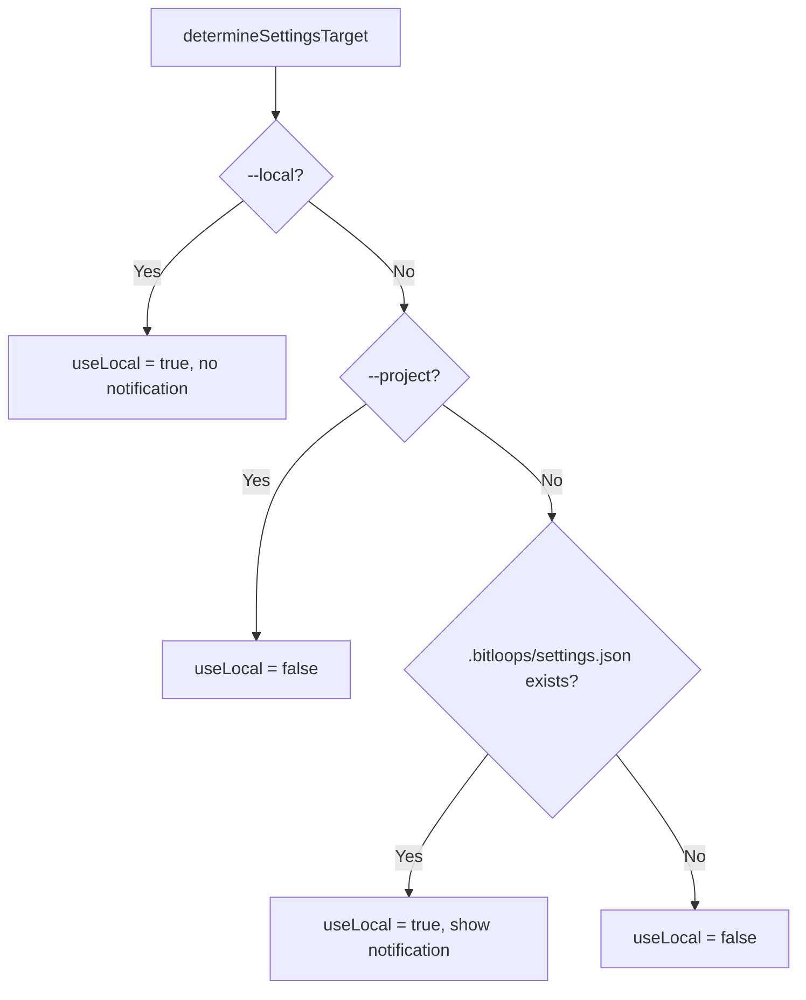
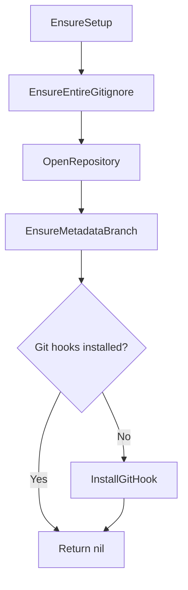
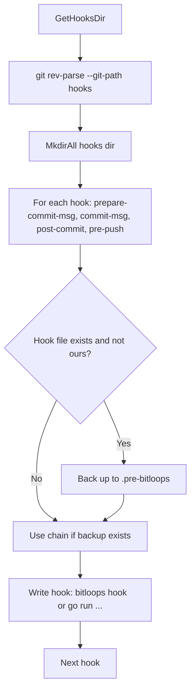

# The `bitloops enable` Command

This document describes how the `bitloops enable` command works and what it does under the hood, including flow diagrams and data flow.

> Rust status note: this document primarily reflects the legacy combined setup flow from the Go reference.
> In current Rust code, agent selection + agent hook installation + telemetry consent run in `bitloops init`,
> while `bitloops enable` handles repository/settings/git-hook strategy setup.

## Overview

`bitloops enable` configures Bitloops in the current project so that session tracking works with your AI agent. It:

- Verifies you are inside a git repository
- Sets up agent-specific hooks (Claude Code, Gemini CLI, OpenCode, Cursor, etc.)
- Creates the `.bitloops/` directory and config
- Installs git hooks (prepare-commit-msg, commit-msg, post-commit, pre-push)
- Ensures the strategy is ready (metadata branch, `.bitloops/.gitignore`)
- Optionally prompts for telemetry consent

Two modes are supported: **interactive** (no `--agent`) and **non-interactive** (`--agent <name>`).

---

## High-Level Flow



---

## Prerequisites and Validation



- **Git repo**: Uses `paths.WorktreeRoot(ctx)`; must be run from inside a git tree.
- **Flags**: `--local` and `--project` are mutually exclusive; they control which settings file is written (see [Settings target](#settings-target) below).
- **Empty repo**: A warning is shown; Bitloops is still configured but checkpoints only work after the first commit.

---

## Mode Selection: Interactive vs Non-Interactive

| Condition                 | Mode            | Behavior                                                              |
| ------------------------- | --------------- | --------------------------------------------------------------------- |
| `--agent` not provided    | Interactive     | Detect or prompt for agents, then run full setup for selected agents. |
| `--agent <name>` provided | Non-interactive | Set up only that agent; no prompts. Uses project settings file.       |
| `--agent` with no value   | Error           | "Missing agent name" and usage hint.                                  |

Non-interactive mode does **not** uninstall hooks for other agents; it only installs or updates hooks for the given agent. Interactive mode can uninstall hooks for agents that were previously selected but are now deselected.

---

## Interactive Path (No `--agent`)

### Agent detection and selection



- **Re-run**: If hooks are already installed for some agents, those agents are pre-selected in the multi-select; others are unchecked. Unselecting an agent and confirming will uninstall that agent’s hooks later.
- **First run**: If exactly one agent is detected (`agent.DetectAll`), it is used without a prompt. If zero or multiple are detected, a multi-select is shown (when TTY is available).
- **Non-TTY**: If the process can’t show a prompt (`/dev/tty` not available, or `ENTIRE_TEST_TTY` not set for tests), the code keeps installed agents or falls back to detected/default.

### Interactive enable steps (after agents are chosen)



1. **Uninstall deselected agent hooks**  
   For each agent that currently has hooks installed but is not in the newly selected list, call `UninstallHooks`. This only runs in the interactive path.

2. **Setup agent hooks**  
   For each selected agent that implements `HookSupport`, call `InstallHooks(ctx, localDev, forceHooks)`. Agent-specific config (e.g. `.claude/settings.json`, `.gemini/settings.json`) is updated.

3. **Setup .bitloops directory**  
   Create `.bitloops/` if missing and run `EnsureEntireGitignore` so `.bitloops/.gitignore` contains required entries (`tmp/`, `settings.local.json`, `metadata/`, `logs/`).

4. **Settings**  
   Load merged settings (project + local), set `Enabled: true` and `LocalDev` (and optionally `push_sessions` from `--skip-push-sessions`), then decide target file with `determineSettingsTarget` and save.

5. **Git hooks**  
   `strategy.InstallGitHook(ctx, true, localDev)` installs or updates the four git hooks; existing non-Bitloops hooks are backed up to `.<hook>.pre-bitloops` and chained.

6. **Hook managers**  
   `CheckAndWarnHookManagers` warns if another tool (e.g. husky) might overwrite hooks and suggests re-running `bitloops enable` if needed.

7. **Telemetry**  
   If not already set, prompt for consent; then save settings again.

8. **EnsureSetup**  
   Ensures `.bitloops/.gitignore`, metadata branch `bitloops/checkpoints/v1`, and git hooks (if missing). See [Strategy setup](#strategy-setup) below.

---

## Non-Interactive Path (`--agent <name>`)

```mermaid
flowchart TD
    Start([setupAgentHooksNonInteractive]) --> Resolve[agent.Get(agentName)]
    Resolve --> CheckHook[Implements HookSupport?]
    CheckHook -->|No| Err[Error: agent does not support hooks]
    CheckHook -->|Yes| InstallAgent[hookAgent.InstallHooks]
    InstallAgent --> SetupDir[setupEntireDirectory]
    SetupDir --> LoadSettings[Load existing settings]
    LoadSettings --> Merge[Set Enabled, LocalDev, push_sessions, Telemetry]
    Merge --> Save[SaveEntireSettings to .bitloops/settings.json]
    Save --> InstallGit[strategy.InstallGitHook]
    InstallGit --> Warn[strategy.CheckAndWarnHookManagers]
    Warn --> Ensure[strategy.EnsureSetup]
    Ensure --> Ready[Print "Ready."]
```

- Agent is resolved by name; it must implement `HookSupport`.
- Hooks are installed only for that agent; other agents’ hooks are left as-is.
- Settings are always written to **project** `.bitloops/settings.json` (not local).
- Telemetry: if `--telemetry=false` or `ENTIRE_TELEMETRY_OPTOUT` is set, telemetry is set to disabled; otherwise no prompt in non-interactive mode.

---

## Settings Target (Interactive Only)

Where settings are written when no `--agent` is used:



- **`--local`**: Always write to `.bitloops/settings.local.json`.
- **`--project`**: Always write to `.bitloops/settings.json`.
- **No flags**: If `.bitloops/settings.json` already exists, write to `.bitloops/settings.local.json` and show: “Project settings exist. Saving to settings.local.json instead. Use --project to update the project settings file.”

This avoids overwriting committed project settings when re-enabling in a repo that already has them.

---

## Strategy Setup (EnsureSetup)

Both interactive and non-interactive paths end with `strategy.EnsureSetup(ctx)`:



- **EnsureEntireGitignore**: Ensures `.bitloops/.gitignore` exists and contains `tmp/`, `settings.local.json`, `metadata/`, `logs/`.
- **EnsureMetadataBranch**: Ensures local branch `bitloops/checkpoints/v1` exists; if the remote has it, the local branch is created from the remote, otherwise an empty orphan branch is created. This is where permanent checkpoint metadata is stored.
- **InstallGitHook** (only if hooks are not already installed): Installs the four git hooks; backs up existing non-Bitloops hooks to `.<name>.pre-bitloops` and chains them so the original hook runs after Bitloops’s.

---

## Git Hooks Installation (strategy.InstallGitHook)



- Hooks directory is resolved via `git rev-parse --git-path hooks` (respects worktrees and `core.hooksPath`).
- Each hook script runs `bitloops hook <hookname>` (or `go run ./cmd/bitloops/main.go hook <hookname>` when `localDev` is true).
- If a non-Bitloops hook already exists, it is renamed to `<hook>.pre-bitloops` and the new script invokes it at the end (chaining).

---

## Agent Hooks (HookSupport.InstallHooks)

Agents that support hooks (e.g. Claude Code, Gemini CLI, OpenCode, Cursor) implement `InstallHooks(ctx, localDev, force bool) (int, error)`:

- **localDev**: Hooks may call `go run` instead of the `bitloops` binary.
- **force**: Remove existing Bitloops hooks for that agent first, then install (used by `--force` / `-f`).

Behavior is agent-specific: e.g. Claude Code updates `.claude/settings.json` with hook configuration; Gemini updates `.gemini/settings.json`. The returned count is the number of hooks (or hook entries) installed; 0 means already up to date (idempotent).

---

## Files and Directories Created or Updated

| Item                                                                 | When / Condition                                                                                                          |
| -------------------------------------------------------------------- | ------------------------------------------------------------------------------------------------------------------------- |
| `.bitloops/`                                                         | Created by `setupEntireDirectory` if missing                                                                              |
| `.bitloops/.gitignore`                                               | Updated by `EnsureEntireGitignore` (required entries)                                                                     |
| `.bitloops/settings.json`                                            | Written when using project settings (non-interactive, or interactive with `--project` or first run with no existing file) |
| `.bitloops/settings.local.json`                                      | Written when using local settings (interactive with `--local` or when project settings already exist and no `--project`)  |
| `prepare-commit-msg`, `commit-msg`, `post-commit`, `pre-push`        | In git hooks dir (`GetHooksDir`); backups `.<name>.pre-bitloops` if replacing existing hooks                              |
| Agent config (e.g. `.claude/settings.json`, `.gemini/settings.json`) | Updated by each agent’s `InstallHooks`                                                                                    |
| `bitloops/checkpoints/v1` branch                                     | Created or updated by `EnsureMetadataBranch` (orphan or from remote)                                                      |

---

## Flags Reference

| Flag                   | Description                                                                                             |
| ---------------------- | ------------------------------------------------------------------------------------------------------- |
| `--agent <name>`       | Non-interactive: set up hooks for this agent only (e.g. `claude-code`, `gemini`, `opencode`, `cursor`). |
| `--local`              | (Interactive) Write settings to `.bitloops/settings.local.json`.                                        |
| `--project`            | (Interactive) Write settings to `.bitloops/settings.json` even if it already exists.                    |
| `--force` / `-f`       | Force reinstall agent hooks (remove existing Bitloops hooks for that agent first).                      |
| `--skip-push-sessions` | Disable automatic pushing of session logs on git push (`strategy_options.push_sessions = false`).       |
| `--telemetry`          | Default true; set to `false` to disable telemetry without prompt.                                       |
| `--local-dev`          | (Hidden) Use `go run` instead of `bitloops` in hooks.                                                   |

---

## Related Code

- **Command and flow**: `cmd/entire/cli/setup.go` — `newEnableCmd`, `runEnableInteractive`, `setupAgentHooksNonInteractive`, `detectOrSelectAgent`, `setupEntireDirectory`, `determineSettingsTarget`.
- **Config**: `cmd/entire/cli/config.go` — `LoadEntireSettings`, `SaveEntireSettings`, `IsEnabled`, `GetAgentsWithHooksInstalled`.
- **Settings**: `cmd/entire/cli/settings/settings.go` — load/save and merge of project vs local.
- **Strategy**: `cmd/entire/cli/strategy/hooks.go` — `InstallGitHook`, `GetHooksDir`; `cmd/entire/cli/strategy/common.go` — `EnsureSetup`, `EnsureEntireGitignore`, `EnsureMetadataBranch`.
- **Agents**: `cmd/entire/cli/agent/` — `Agent`, `HookSupport`, `DetectAll`, per-agent `InstallHooks` (e.g. `claudecode/hooks.go`, `geminicli/hooks.go`).
