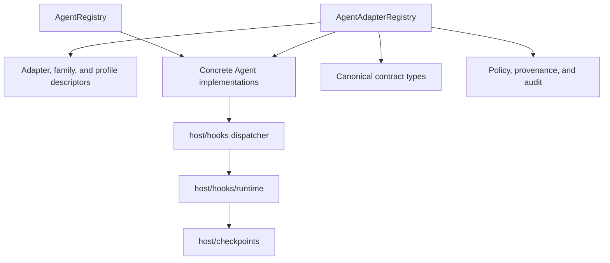

# Bitloops agent-adapter architecture

This document describes the architecture under `bitloops/src/adapters/agents` and how it plugs into `host/hooks` and `host/checkpoints`.

## Agent adapters are their own subsystem

Agent adapters are not capability packs and they are not language packs.

They solve a different problem:

- detect and integrate external coding agents
- install or validate hook surfaces
- read and write native transcripts
- analyse transcripts where supported
- feed the shared checkpoint lifecycle

## Architecture overview

## Two registries, two roles

### `AgentRegistry`

`AgentRegistry` is the simple runtime registry of instantiated agents.

It is used for tasks such as:

- listing available agents
- looking up an agent by name or type
- detecting which agents are present in the repo
- aggregating protected directories

### `AgentAdapterRegistry`

`AgentAdapterRegistry` is the richer descriptor-driven registry.

It validates and stores:

- adapter descriptors
- protocol families
- target profiles
- aliases
- package metadata
- runtime compatibility
- configuration schema
- readiness and resolution traces

This is the real architectural model for agent adapters.

## Descriptor model

Each adapter registration contains three nested descriptor concepts.

### 1. Protocol family

A protocol family describes the shared hook and runtime model.

Built-in families are:

- `jsonl-cli`
- `json-event`

### 2. Target profile

A target profile captures agent-specific identity and aliases inside a family.

Examples:

- `claude-code`
- `codex`
- `cursor`
- `copilot`
- `gemini`
- `opencode`

### 3. Adapter descriptor

The adapter descriptor ties together:

- adapter id
- display name
- agent type
- protocol family
- target profile
- supported capabilities
- runtime compatibility
- package metadata
- config schema

## Package metadata model

The richer registry also validates package-like metadata for built-ins.

That metadata covers:

- metadata version
- source
- trust model
- responsibility boundary
- lifecycle phases
- compatibility claims

Today the built-ins all use `first_party_linked(...)`, which means the host still owns:

- resolution
- validation
- lifecycle control
- audit

## Built-in adapters

| Adapter | Family | Rich transcript analysis | Hook installation |
| --- | --- | --- | --- |
| Claude Code | `jsonl-cli` | No | Yes |
| Codex | `jsonl-cli` | No | Yes |
| Cursor | `jsonl-cli` | No | Yes |
| OpenCode | `jsonl-cli` | Partial session handling, no canonical analyser trait | Yes |
| Copilot | `json-event` | Yes | Yes |
| Gemini | `json-event` | Yes | Yes |

### Notes on built-ins

- Claude Code is intentionally minimal.
- Codex and Cursor are JSONL-oriented transcript adapters.
- Copilot and Gemini implement richer transcript analysis and token calculation.
- OpenCode uses a plugin-based hook installation path rather than the same directory layout as the other adapters.

## Low-level `Agent` trait

The low-level `Agent` trait provides the common operational surface:

- identity
- presence detection
- hook names
- hook-event parsing
- transcript I/O
- session-file resolution
- session read and write
- resume-command formatting

Optional traits add richer behaviour:

- `HookSupport`
- `FileWatcher`
- `TranscriptAnalyzer`
- `TokenCalculator`
- `TranscriptPositionProvider`

This split keeps the base contract small while allowing richer integrations when the native agent format supports it.

## Canonical contract and policy

Two modules make the agent system more than a collection of ad hoc hook scripts.

### Canonical contract

`adapters/agents/canonical` defines host-owned normalised types for:

- agent identity
- session descriptors
- invocation requests and responses
- lifecycle events
- progress updates
- stream events
- result fragments
- resumable sessions

### Policy, provenance, and audit

`adapters/agents/policy` defines:

- policy decisions such as allow, deny, restricted, and redacted
- provenance metadata
- audit records
- helpers for attaching policy and provenance to canonical flows

This is important because it moves control of lifecycle semantics back to the host instead of burying them inside each adapter.

## Hook runtime integration

The adapter layer feeds into `host/hooks`.

### `host/hooks/dispatcher`

This module defines:

- the `bitloops hooks` CLI surface
- agent-specific hook verbs
- routing from raw stdin payloads to the correct lifecycle handler

### `host/hooks/runtime`

This module contains shared runtime logic for:

- session-start handling
- prompt submission handling
- stop handling
- task lifecycle updates
- integration with checkpoint strategies

### `host/checkpoints`

The shared checkpoint subsystem then owns:

- session state
- phase transitions
- transcript offsets
- pre-prompt and pre-task state
- checkpoint persistence
- Git-backed commit strategies

That separation is the central design choice of the agent subsystem: adapters normalise agent-specific behaviour, while the host owns checkpoint semantics.

## Why the agent subsystem is more mature than the language subsystem

Compared with language adapters, agent adapters already have:

- a descriptor registry
- explicit protocol-family and target-profile composition
- package metadata validation
- readiness modelling
- canonical contract types
- policy and provenance support
- shared lifecycle routing

So the agent side is closer to a complete adapter architecture, even though each built-in still has target-specific file layouts and transcript formats.

## Current limitations

### 1. Built-ins still dominate execution

The registry is descriptor-driven, but actual behaviour is still implemented by built-in Rust types such as `CodexAgent`, `CursorAgent`, and `CopilotCliAgent`.

### 2. Canonical contract adoption is uneven

The canonical types and policy layer are present, but not every agent path is equally rich in practice.

### 3. Hook shapes are still adapter-specific

The shared lifecycle runtime starts after adapter-specific hook parsing. That is sensible, but it means onboarding a new agent still requires concrete parser and installer work.
