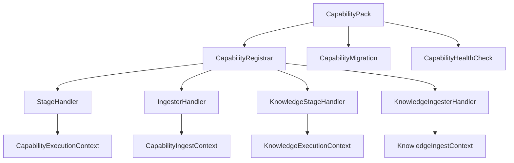

# Bitloops capability-pack architecture

This document describes the executable capability-pack system under `bitloops/src/capability_packs` and `bitloops/src/host/capability_host`.

The important rule is simple:

- **capability packs own domain behaviour**
- **the host owns infrastructure and integration seams**

## What a capability pack can contribute

A capability pack can contribute:

- stages
- ingesters
- migrations
- health checks
- schema metadata and query examples

The public GraphQL surface is typed. Packs no longer rely on the public `extension(stage: ...)` field.

## Shared contract

## Registration lifecycle

1. `DevqlCapabilityHost::builtin(...)` constructs the runtime host.
2. `capability_packs::builtin_packs(...)` returns built-in pack instances.
3. Each pack exposes a `CapabilityDescriptor`.
4. Each pack registers runtime contributions through `CapabilityRegistrar`.
5. The host stores stages, ingesters, migrations, health checks, schema metadata, and query examples.
6. GraphQL resolvers delegate to host-owned stage resolution or pack-owned services through typed fields.

## Host-owned execution context

Capability packs should treat the execution and ingest contexts as their only runtime integration surface.

The current core context surfaces include:

- `graph()`
- `host_relational()`
- `languages()`
- `test_harness_store()`
- `blob_payloads()`
- `connectors()`
- `provenance()`

Pack-specific specialised access currently includes:

- `knowledge_relational()`
- `knowledge_documents()`
- `clone_edges_rebuild_relational()`

Two practical consequences follow from this:

- packs do not open their own repositories or stores
- packs do not run external commands directly

## Pack isolation rules

The intended pack boundary is:

- pack logic may call host-owned gateways and services
- pack logic may not bootstrap storage backends
- pack logic may not choose SQLite/Postgres/DuckDB implementations
- pack logic may not talk to another pack’s store directly

The codebase now reflects that boundary more strongly than before:

- `test_harness` receives its repository through `test_harness_store()` from the host
- `test_harness` consumes language-aware behaviour through `languages()`
- `semantic_clones` uses `clone_edges_rebuild_relational()` rather than a capability-scoped raw relational escape hatch

`CapabilityIngestContext::devql_relational_scoped(...)` still exists for legacy internal code paths, but it is no longer the preferred pattern and should not be used for new pack work.

## Built-in packs

| Pack | Runtime role | Current boundary shape |
| --- | --- | --- |
| `knowledge` | External knowledge ingestion, relation management, and retrieval | Service-driven and already host-oriented. |
| `test_harness` | Test discovery, linkage, coverage, and classifications | Now uses host-owned language and repository services. |
| `semantic_clones` | Embedding/clone-edge rebuild | Uses a dedicated clone-rebuild relational gateway. |

## `knowledge`

The Knowledge pack remains the cleanest reference implementation.

It relies on the host for:

- relational access
- document storage
- blobs
- connectors
- provenance
- config

Its internal services still own Knowledge-specific business logic:

- ingestion
- relation management
- retrieval

## `test_harness`

`test_harness` is where the isolation work changed the most.

### What changed

- the pack no longer opens `BitloopsTestHarnessRepository` during pack construction
- stage handlers and ingesters now resolve the repository from the host context
- structural mapping now resolves language support through `LanguageServicesGateway`
- public GraphQL access is typed through `tests`, `coverage`, and `testsSummary`

### What stays in the pack

The pack still owns:

- orchestration of repository scanning
- linkage policy and confidence rules
- materialisation into test artefacts and edges
- coverage ingestion
- classification rebuild
- pack-owned persistence semantics

### What moved behind the host

Language-specific discovery concerns now come from the language-adapter runtime through `LanguageTestSupport`.

That means:

- Rust, TypeScript/JavaScript, and Python test discovery support are accessed via the host
- `test_harness` no longer needs a pack-owned registry to decide which language parser to call at runtime

## `semantic_clones`

`semantic_clones` still contributes one main ingester, but its boundary is narrower now.

The rebuild path uses a dedicated host gateway:

- `clone_edges_rebuild_relational()`

That keeps the capability-specific write path explicit and avoids treating the shared DevQL relational store as a generally pack-visible dependency.

## GraphQL and capability packs

GraphQL is the canonical DevQL product contract, but packs do not own GraphQL execution directly.

The flow is:

1. GraphQL resolves a typed field
2. resolver code delegates into the host
3. the host resolves the owning pack or host service
4. the pack executes through host-owned contexts

Today the typed GraphQL fields are still assembled statically in the GraphQL layer. The architectural direction is host-owned runtime composition from explicit capability contributions.

## Contributor guidance

For new pack work:

- add typed stages and ingesters first
- expose behaviour through typed GraphQL fields, not generic stage passthrough
- inject stores and external services from the host
- if a language-specific concern is reusable, extend the language-adapter runtime rather than embedding another pack-local parser
