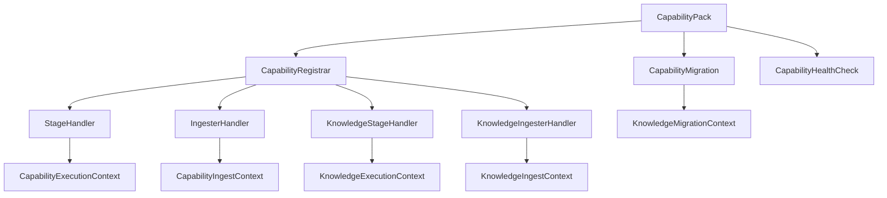

# Bitloops capability-pack architecture

This document describes the executable capability-pack system implemented under `bitloops/src/capability_packs` and `bitloops/src/host/capability_host`.

## What a capability pack is

A capability pack is a repository-scoped feature module that can contribute one or more of the following to DevQL:

- stages
- ingesters
- schema modules
- query examples
- migrations
- health checks

The executable contract is host-owned and pack-agnostic.

## Shared contract

## Registration lifecycle

1. `DevqlCapabilityHost::builtin(...)` builds the host.
2. `capability_packs::builtin_packs(...)` returns the built-in packs.
3. Each pack exposes a `CapabilityDescriptor`.
4. Each pack registers contributions through `CapabilityRegistrar`.
5. Core/non-knowledge contributions use `register_stage` / `register_ingester`; knowledge contributions use `register_knowledge_stage` / `register_knowledge_ingester`.
6. The host stores migrations and health checks alongside the registration.
7. At runtime the host invokes stages or ingesters by `(capability_id, contribution_id)` with core or knowledge typed dispatch.

## Common pack structure

Most packs follow this shape:

| File or module                | Role                                                       |
| ----------------------------- | ---------------------------------------------------------- |
| `descriptor.rs`               | Static pack descriptor and dependencies.                   |
| `pack.rs`                     | `CapabilityPack` implementation.                           |
| `register.rs`                 | Wiring of stages, ingesters, schema modules, and examples. |
| `stages/`                     | Query-stage handlers.                                      |
| `ingesters/`                  | Ingestion handlers.                                        |
| `migrations/`                 | Pack-owned schema changes.                                 |
| `health/`                     | Readiness and configuration checks.                        |
| `storage/` or service modules | Pack-internal storage and service code.                    |

## Built-in pack comparison

| Pack              | Registered stages | Registered ingesters | Migrations | Health checks | Main storage surface                                                              |
| ----------------- | ----------------- | -------------------- | ---------- | ------------- | --------------------------------------------------------------------------------- |
| `knowledge`       | 1                 | 4                    | 1          | 3             | Host relational + knowledge relational/document repositories + blobs + connectors |
| `test_harness`    | 5                 | 4                    | 1          | 3             | Optional test-harness repository plus DevQL relational                            |
| `semantic_clones` | 0                 | 1                    | 1          | 1             | DevQL relational only                                                             |

The `semantic_clones` pack is worth calling out: it contributes an ingester and schema module, but it does not register a normal DevQL stage handler today.

## Knowledge pack

### Purpose

The Knowledge pack ingests repository-scoped external knowledge, versions it, stores the payload, and exposes query-time retrieval.

### Descriptor

`knowledge/descriptor.rs` defines:

- id: `knowledge`
- version: `0.1.0`
- dependency: `test_harness >= 0.1.0`

### Contributions

Registered contributions are:

- stage: `knowledge`
- ingesters:
  - `knowledge.add`
  - `knowledge.associate`
  - `knowledge.refresh`
  - `knowledge.versions`
- schema module: `knowledge`
- query examples: list, revision-scoped list, and field projection

### Runtime design

The pack is service-driven:

- `KnowledgeIngestionService`
- `KnowledgeRelationService`
- `KnowledgeRetrievalService`

It relies on the host context for:

- `knowledge_relational()` writes and reads
- `knowledge_documents()` writes and reads
- `host_relational()` for checkpoint and artefact resolution
- blob payload persistence
- external connector selection
- provenance generation
- config view access

### Storage and connector boundaries

Knowledge is the cleanest pack boundary in the current codebase:

- host relational access stays pack-agnostic (`RelationalGateway`)
- knowledge relational/document access lives behind `KnowledgeRelationalRepository` and `KnowledgeDocumentRepository`
- payload blobs live behind the blob gateway
- external fetches go through `adapters/connectors`

### Migrations and health

Its initial migration runs through `MigrationRunner::Knowledge` and initialises both knowledge relational and knowledge document schema via `KnowledgeMigrationContext`.

Its health checks cover:

- config
- storage
- connectors

## Test Harness pack

### Purpose

The Test Harness pack manages verification data such as test discovery, coverage ingestion, linkage, and classification.

### Descriptor

`test_harness/descriptor.rs` defines:

- id: `test_harness`
- version: `0.1.0`
- no declared pack dependencies

### Contributions

Registered stages are:

- `tests`
- `test_harness_tests`
- `test_harness_tests_summary`
- `coverage`
- `test_harness_coverage`

Registered ingesters are:

- `test_harness.linkage`
- `test_harness.coverage`
- `test_harness.classification`

It also contributes:

- schema module: `test_harness`
- query examples for tests, coverage, and commit-level test harness snapshot (`test_harness_tests_summary`)

### Runtime design

This pack uses an optional `BitloopsTestHarnessRepository` wrapped in `Arc<Mutex<...>>`.

That tells you two things about the current implementation:

1. the pack has a concrete repository implementation outside the generic DevQL relational surface
2. the runtime must tolerate the repository being unavailable and return structured failures instead of panicking

### Query-stage behaviour

The stages are mixed in maturity:

- `tests` and `coverage` are real stage handlers
- they call back into DevQL through `execute_devql_subquery(...)`
- those subqueries target core stages such as `__core_test_links` and coverage-related internal stages
- `test_harness_tests_summary` returns a commit-scoped snapshot (row counts and coverage presence) from the test-harness relational store when `query_context.resolved_commit_sha` is set

So this pack is executable and useful today, but it still depends on some core DevQL query surfaces rather than fully owning every query path.

### Ingestion behaviour

The ingesters cover:

- test linkage and discovery
- coverage ingestion from LCOV or LLVM JSON
- coverage-derived classification rebuild

When the repository store is unavailable, the ingesters return a structured failure such as `test_harness_relational_store_unavailable`.

### Migrations and health

Its migration applies test-domain DDL to the DevQL SQLite relational store.

Its health checks cover:

- config
- storage
- dependencies

## Semantic Clones pack

### Purpose

The Semantic Clones pack runs semantic feature extraction, embeddings, and clone-edge rebuild for symbols.

### Descriptor

`semantic_clones/descriptor.rs` defines:

- id: `semantic_clones`
- version: `0.1.0`
- no declared pack dependencies

### Contributions

Executable contributions registered on `DevqlCapabilityHost` are:

- ingester: `semantic_clones.rebuild`
- schema module: `semantic_clones.schema`
- query example for `clones(...)`

Notably, it does **not** register a normal stage handler through `CapabilityRegistrar`.

### Runtime design

The key ingester uses `devql_relational_scoped("semantic_clones")`.

That matters because it means:

- the host explicitly binds the DevQL relational handle to the invoking capability id
- the pack rebuilds clone edges against the shared DevQL relational store
- the pack does not expose general relational access to unrelated pack invocations

### Internal pipeline

The pack still has a clear internal pipeline even though it only registers one ingester:

- stage 1: semantic features
- stage 2: embeddings
- stage 3: clone-edge rebuild

Those stages are internal pipeline phases, not host-registered DevQL stages.

### Migrations and health

Its migration initialises `symbol_clone_edges` on DevQL SQLite.

Its health surface is currently minimal:

- config availability only

### Architectural nuance

The pack still ships an `extension_descriptor.rs` helper used by the metadata side and by provider-builder helpers, but the executable runtime is the `CapabilityPack` path.

## Cross-pack rules

`host/capability_host/policy.rs` defines the rules for cross-pack composition.

A pack may invoke a registered stage owned by another pack when one of these is true:

- it is invoking its own stage
- it declares a descriptor dependency on the other pack
- the repo config grants access through `host.cross_pack_access`

This is how the host keeps composition explicit instead of allowing unrestricted pack-to-pack calls.

## Why the capability-pack system works well

The strong parts of this design are:

- one executable host contract
- explicit registration of contributions
- host-owned timeouts and policy
- host-owned migration and health orchestration
- pack-local service code behind common contexts

## Where the edges still show

The main current imperfections are:

- `test_harness` still leans on core DevQL internal stages for some query work
- `semantic_clones` exposes an ingester and query example, but not a registered stage handler
- `CoreExtensionHost` still tracks parallel descriptor metadata for some capability packs

Those are manageable, but they should be documented accurately.
