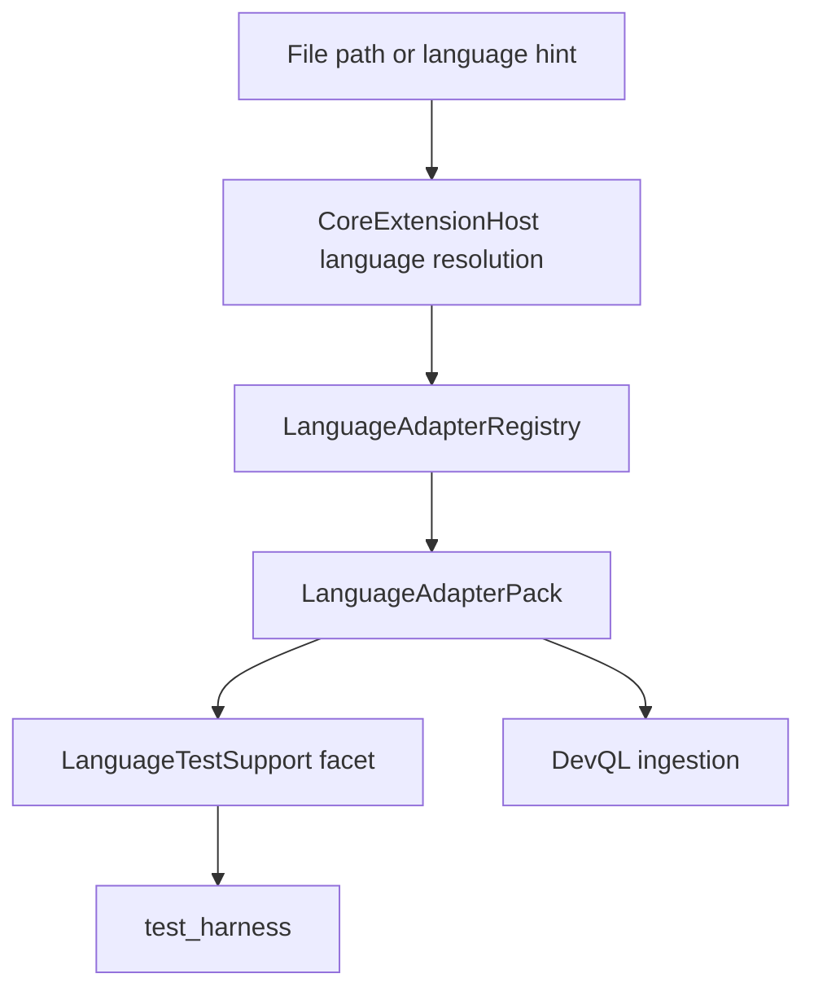

# Bitloops language-adapter architecture

This document describes the host-owned language-adapter runtime implemented under:

- `bitloops/src/host/language_adapter`
- `bitloops/src/adapters/languages`

Contributor onboarding guide:

- `docs/language-adapter-contributing.md`

## Summary

Language adapters are no longer just artefact extractors for DevQL ingestion.

They are now the shared source of language semantics for the rest of the system. The first reusable semantic facet is `LanguageTestSupport`, which allows `test_harness` to consume language-specific test discovery through the host rather than through a pack-local parser registry.

## Module layout

The runtime is split into two layers:

- `host/extension_host/language`
  - descriptor resolution and profile ownership
- `host/language_adapter` plus `adapters/languages`
  - executable language semantics

## Base runtime contract

`LanguageAdapterPack` remains the host-owned runtime contract.

It provides:

- descriptor identity
- canonical mappings
- supported language kinds
- artefact extraction
- dependency-edge extraction
- optional file-docstring extraction
- optional reusable facets such as `test_support()`

Built-in packs live under `bitloops/src/adapters/languages`.

Current built-ins:

- Rust
- TypeScript/JavaScript
- Python

## Shared test-support facet

`LanguageTestSupport` is now part of the host language-adapter API.

It exposes language-specific test behaviour through a reusable contract:

- `supports_path(...)`
- `discover_tests(...)`
- `enumerate_tests(...)`
- `reconcile(...)`

Shared model types also live in `host/language_adapter`, including:

- `DiscoveredTestFile`
- `DiscoveredTestSuite`
- `DiscoveredTestScenario`
- `ReferenceCandidate`
- `EnumerationResult`
- `ReconciledDiscovery`
- `StructuralMappingOutput`

## Host-owned execution context

`LanguageAdapterContext` is host-owned and now includes command execution support for best-effort runtime enumeration.

That matters because:

- adapters may request commands such as `cargo test -- --list`
- adapters do not spawn commands directly
- the host controls timeout, repo root, and diagnostics

This keeps language adapters inside the same isolation model as capability packs.

## `test_harness` integration

`test_harness` now consumes language semantics through `LanguageServicesGateway`.

The current flow is:

1. resolve the owning language support for a candidate path
2. discover tests through the adapter facet
3. optionally enumerate tests through the adapter facet
4. reconcile source and enumerated results
5. perform linkage/materialisation in `test_harness`

This is a deliberate change from the older design where `test_harness` carried its own runtime registry under `capability_packs/test_harness/mapping/languages`.

## Current implementation notes

The host-facing architecture is in place, but the implementation is still being simplified internally.

Today:

- `test_harness` executes through the host language service
- adapter packs expose `LanguageTestSupport`
- Rust runtime enumeration uses the host-owned command runner

Still transitional:

- some adapter-side test-support wrappers reuse the older `test_harness` language-provider code behind the new facet
- that scaffolding exists to preserve behaviour while the logic is moved fully into adapter-owned modules

## Design rules for future work

- reusable language semantics belong in `host/language_adapter` and `adapters/languages`
- pack-specific business rules belong in the consuming capability pack
- new capability-pack features should ask whether they need a reusable language facet before introducing another pack-local parser

Examples of good facet candidates:

- test discovery
- runtime enumeration
- framework-specific file classification
- reference extraction that is reusable across packs

Examples of concerns that should stay in capability packs:

- confidence scoring
- linkage policy
- materialisation rules
- pack-specific persistence
