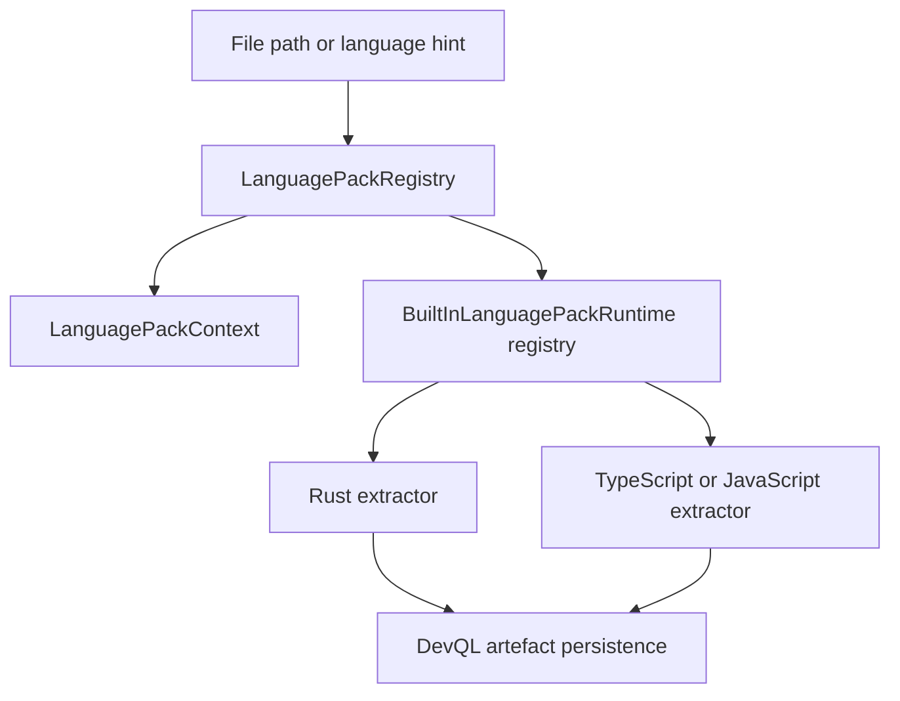

# Bitloops language-adapter architecture

This document describes the implemented equivalent of a language-adapter layer.

## Naming clarification

There is no dedicated `bitloops/src/adapters/languages` module today.

The implemented language-adapter story is split across:

- `host/extension_host/language`: language-pack descriptors, profiles, aliases, and resolution
- `host/extension_host/host/builtins.rs`: built-in language-pack metadata
- `host/devql/ingestion/artefact_persistence.rs`: built-in runtime registry keyed by language-pack id
- `host/devql/ingestion/extraction_rust.rs`: Rust extraction runtime
- `host/devql/ingestion/extraction_js_ts.rs`: TypeScript/JavaScript extraction runtime

So when this document says “language adapter”, it means that combined system.

## Architecture overview

## Layer 1: descriptor and profile resolution

`LanguagePackRegistry` owns the metadata side.

### What it stores

It stores:

- language-pack descriptors
- pack aliases
- ownership of supported languages
- profile aliases
- profiles by language
- profiles by file extension
- registration observations

### What a language pack descriptor contains

A `LanguagePackDescriptor` declares:

- pack id
- version and API version
- display name
- aliases
- supported languages
- language profiles
- extension compatibility rules

### What a language profile descriptor contains

A `LanguageProfileDescriptor` declares:

- profile id
- display name
- language id
- optional dialect
- aliases
- file extensions
- supported source-version ranges

### Resolution rules

The registry can resolve by:

- profile key
- language id
- file path
- structured language profile input

It rejects ambiguous or invalid inputs rather than guessing silently.

That behaviour is important because the runtime extractor table is keyed by resolved pack id. If resolution is sloppy, runtime execution becomes unsafe.

## Built-in language packs

The built-ins registered by `CoreExtensionHost` are:

| Pack id | Supported languages | Profiles |
| --- | --- | --- |
| `rust-language-pack` | `rust` | `rust-default` |
| `ts-js-language-pack` | `typescript`, `javascript`, `tsx`, `jsx` | `typescript-standard`, `javascript-standard` |

### Rust pack

- alias: `rust-pack`
- profile alias: `rust-profile`
- file extension: `rs`
- supported source version: `^1.70`

### TypeScript/JavaScript pack

- aliases: `typescript-pack`, `javascript-pack`
- TypeScript profile aliases include `ts`
- JavaScript profile aliases include `js`
- supported extensions include `ts`, `tsx`, `mts`, `cts`, `js`, `jsx`, `mjs`, `cjs`

## Layer 2: DevQL runtime mapping

After language-pack resolution, DevQL still needs an executable runtime.

That runtime lives in `host/devql/ingestion/artefact_persistence.rs` as `BuiltInLanguagePackRuntime`.

Each entry provides three functions:

- artefact extraction
- dependency-edge extraction
- file-docstring extraction

The registry is keyed by the descriptor id from `CoreExtensionHost`.

That means the current runtime contract between metadata and execution is a shared pack id, not a dynamically loaded executable plug-in.

## Runtime extractors

### Rust extractor

`extraction_rust.rs` uses tree-sitter Rust to produce artefacts such as:

- modules
- structs
- enums
- traits
- types
- consts and statics
- impl blocks
- functions and methods
- use declarations

It also extracts Rust file docstrings.

### TypeScript/JavaScript extractor

`extraction_js_ts.rs` tries TypeScript and JavaScript tree-sitter grammars and extracts artefacts such as:

- functions
- interfaces
- type aliases
- enums
- classes
- methods
- class fields
- top-level variables
- import statements

If parsing fails, DevQL logs a warning and can still preserve file-level state.

## Runtime flow during ingestion

1. DevQL determines a language id from the file path or caller input.
2. `CoreExtensionHost` resolves the owning language pack and profile.
3. DevQL builds a `LanguagePackContext` containing repo root, repo id, and optional commit sha.
4. DevQL looks up a `BuiltInLanguagePackRuntime` by resolved pack id.
5. The extractor emits artefacts, dependency edges, and optional file docstrings.
6. DevQL persists the result into current-state tables.

## What is good about the current design

The strong parts are:

- deterministic language and profile resolution
- explicit ownership of languages and file extensions
- support for aliasing and source-version constraints
- a clear bridge from metadata selection to runtime execution

## Current limitations

### 1. Runtime execution is still built in

The descriptor layer is extensible, but the executable runtime is still a hard-coded table.

In practice that means:

- third-party language packs are not yet executable
- adding a new language requires both metadata registration and Rust runtime wiring

### 2. `LanguagePackContext` is still thin

It currently carries identity information, but not executable hooks or storage surfaces.

That is consistent with the present design, but it shows that language packs are still descriptors rather than full runtime extensions.

### 3. Pack metadata and extraction logic live in different places

The metadata is under `host/extension_host`, while the extraction runtime is under `host/devql/ingestion`.

That split is workable, but it is the main reason the old “single adapter layer” description was misleading.

## Related but separate code

`capability_packs/test_harness/mapping/languages` contains language-aware test-discovery logic for the Test Harness pack. That code is pack-internal and should not be confused with the host-level language-pack mechanism described here.
