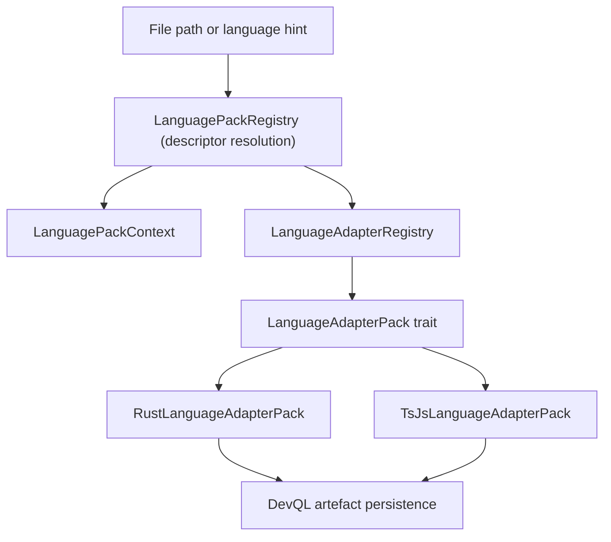

# Bitloops language-adapter architecture

This document describes the current layered language-adapter implementation.

Contributor onboarding guide:

- `docs/language-adapter-contributing.md`

## Module layout

There is now a dedicated language-adapter runtime layer:

- `bitloops/src/host/language_adapter.rs` + `bitloops/src/host/language_adapter/`
- `bitloops/src/adapters/languages.rs` + `bitloops/src/adapters/languages/`

The module roots follow the sibling file+folder pattern (`languages.rs` with `languages/`, `language_adapter.rs` with `language_adapter/`), not `mod.rs` roots.

## Architecture overview

## Layer 1: descriptor and profile resolution

`host/extension_host/language` remains the metadata layer.

It is the chooser layer: it resolves language-pack ownership from language hints, profile inputs, file extension/path, and optional dialect/source-version context, then returns a stable pack id such as:

- `rust-language-pack`
- `ts-js-language-pack`

That pack id is the bridge to runtime execution.

## Layer 2: runtime adapter contract

`host/language_adapter` defines the runtime contract and shared types:

- `LanguageAdapterPack` trait (`pack.rs`)
- `LanguageAdapterRegistry` (`registry.rs`)
- shared artefact/edge types (`types.rs`)
- canonical mapping model and resolver (`canonical.rs`)
- adapter errors and execution context (`errors.rs`, `context.rs`)
- shared edge builders (`edges_shared.rs`, `edges_export.rs`, `edges_inherits.rs`, `edges_reference.rs`)

The trait contract provides:

- descriptor identity (`descriptor`)
- canonical mappings and supported kinds
- artefact extraction
- dependency-edge extraction
- optional file-docstring extraction

## Built-in adapter packs

Built-ins now live under `adapters/languages`:

- `bitloops/src/adapters/languages/rust.rs` with implementation in `.../rust/{pack,extraction,edges,canonical}.rs`
- `bitloops/src/adapters/languages/ts_js.rs` with implementation in `.../ts_js/{pack,extraction,edges,canonical}.rs`

`bitloops/src/adapters/languages.rs` exports `builtin_language_adapter_packs()` and registers both packs.

## Runtime flow during ingestion

1. DevQL determines language from file path or explicit input.
2. `CoreExtensionHost` resolves the owning language pack id and profile.
3. DevQL gets the global `LanguageAdapterRegistry` (lazy-initialized in `host/devql.rs`).
4. DevQL looks up the pack by resolved pack id.
5. The pack extracts artefacts, dependency edges, and optional file docstring.
6. DevQL persists results into current-state tables.

## Design strengths

- descriptor and runtime concerns are separated cleanly
- runtime dispatch is trait-based, not a hard-coded function-pointer table
- canonical mapping is table-driven per adapter pack
- extraction logic is colocated with each language pack

## Current limitations

### 1. Runtime registration is still built-in at startup

`builtin_language_adapter_packs()` currently registers only compiled built-ins. The contract is extensible, but external runtime pack loading is not implemented yet.

### 2. Descriptor metadata and runtime execution are split by design

`host/extension_host/language` contains descriptor metadata and resolution rules (pack ids, aliases, profiles, file extensions, source-version compatibility). It answers: "which pack should own this input?"

`host/language_adapter` plus `adapters/languages` contain runtime extraction behavior. They answer: "how does the selected pack extract artefacts and edges?"

This keeps pack-selection/validation separate from runtime parsing code, with the tradeoff that contributors need to understand both layers.

## Related but separate code

`capability_packs/test_harness/mapping/languages` is test-harness-specific language logic and is not part of the host language-adapter runtime layer.
