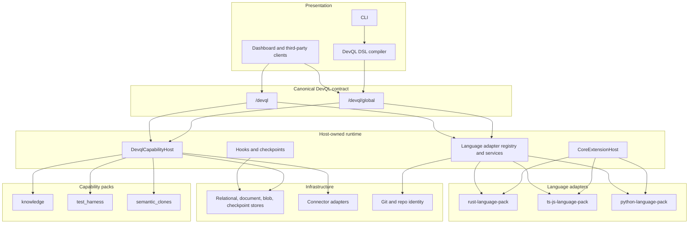
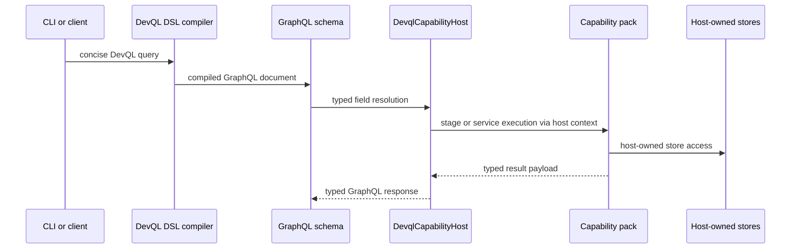
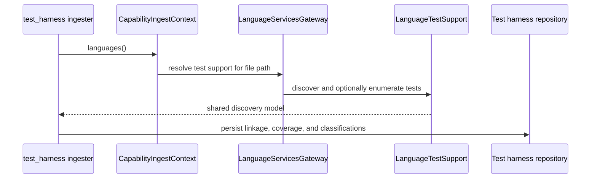

# Bitloops layered extension architecture

This document describes the runtime architecture implemented in this repository today.

The central rule is:

- **GraphQL is the canonical DevQL contract**
- **the host owns execution, storage selection, command execution, and schema composition**
- **capability packs and language adapters plug into the host through explicit contracts**

DevQL DSL remains a concise authoring syntax. It compiles to GraphQL and executes through the `/devql` endpoints rather than bypassing GraphQL.

## High-level view

## Runtime layers

| Layer | Main modules | Responsibility |
| --- | --- | --- |
| Presentation | `bitloops/src/cli`, `bitloops/src/api` | CLI commands, dashboard/API routes, DevQL DSL parsing, and GraphQL transport. |
| Canonical DevQL contract | `bitloops/src/graphql` | The public query and mutation surface for DevQL. |
| Host runtime | `bitloops/src/host` | Capability execution, language resolution, pack lifecycle, policy, and integration boundaries. |
| Capability packs | `bitloops/src/capability_packs` | Domain behaviour such as knowledge, test linkage, coverage, and semantic clones. |
| Adapters | `bitloops/src/adapters` | Language runtimes, agent integrations, and external connectors. |
| Infrastructure | `storage`, `config`, `git`, `telemetry`, `models` | Persistence, repo identity, config, and shared domain types. |

## Architectural boundaries

### 1. GraphQL is the DevQL product contract

The two GraphQL surfaces are first-class product interfaces:

- `/devql/global`
- `/devql`

DevQL DSL compiles into GraphQL documents that target those endpoints. The DSL is a shorthand, not a parallel execution engine.

Important current rules:

- typed GraphQL fields are the public capability-pack surface
- the generic `extension(stage: ...)` field has been removed from the public schema
- `tests`, `coverage`, and `testsSummary` are now exposed as typed GraphQL fields

### 2. The host owns execution beneath GraphQL

`bitloops/src/host/capability_host` owns executable capability packs.

It is responsible for:

- registering stages and ingesters
- resolving the owning capability for an internal stage
- constructing execution and ingest contexts
- selecting and attaching storage backends
- mediating pack access to connectors, provenance, and language services

Capability packs no longer own infrastructure bootstrapping. For example, `test_harness` now receives its repository through the host context instead of opening it inside the pack.

### 3. `CoreExtensionHost` remains the metadata and ownership layer

`bitloops/src/host/extension_host` still owns descriptor-level concerns:

- language-pack profile resolution
- capability descriptor ownership and readiness
- compatibility checks
- diagnostics and registry reports

This remains distinct from `DevqlCapabilityHost`, which executes runtime handlers.

### 4. Language adapters are reusable host-owned semantics

`bitloops/src/host/language_adapter` and `bitloops/src/adapters/languages` now provide more than artefact extraction.

The runtime contract covers:

- artefact extraction
- dependency-edge extraction
- optional file docstring extraction
- optional language facets such as `LanguageTestSupport`

`LanguageTestSupport` is the first shared facet. It lets the host expose language-specific test discovery, enumeration, and reconciliation to capability packs without those packs owning parallel parsers.

### 5. Capability packs are isolated behind host-owned ports

Capability packs must treat the host context as the only integration surface.

In practice this means:

- packs do not open stores directly
- packs do not choose storage engines
- packs do not execute external commands directly
- packs do not import language-adapter implementation modules directly
- cross-pack interaction happens through host-owned stages, ingesters, and gateways

The current code reflects that direction:

- `test_harness` consumes `languages()` and `test_harness_store()` from the host context
- `semantic_clones` uses `clone_edges_rebuild_relational()` rather than `devql_relational_scoped(...)`
- GraphQL resolvers call typed stage adapters rather than the removed public `extension(stage)` field

## Key runtime flows

### DevQL query flow

### Language-aware test-harness flow

## Current implementation status

The architecture direction is clear, but two pieces are still in transition:

- GraphQL remains statically assembled in Rust code today; the long-term direction is host-owned runtime stitching from capability contributions.
- The old pack-local `test_harness` language-provider modules still exist as implementation scaffolding behind the new adapter facet, even though `test_harness` itself now executes through the host language service.

## Summary

Bitloops now has one dominant runtime shape:

- GraphQL is the canonical DevQL contract
- the host owns execution beneath that contract
- language adapters provide reusable language semantics
- capability packs consume host-owned ports rather than infrastructure directly
