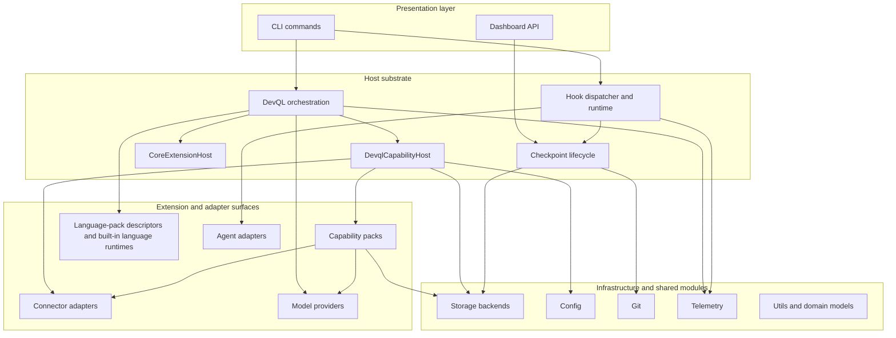
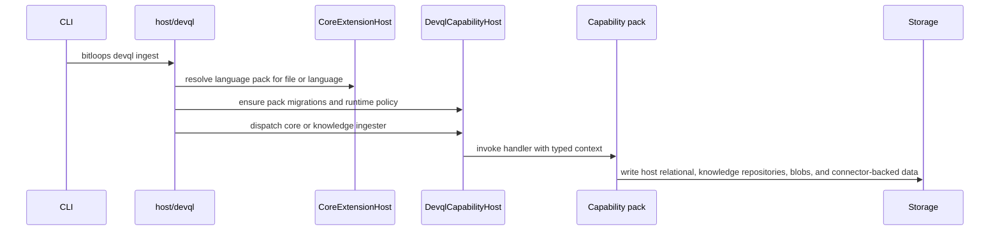
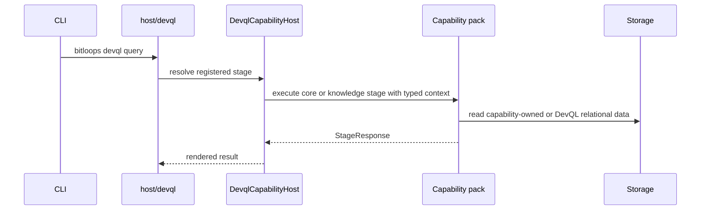
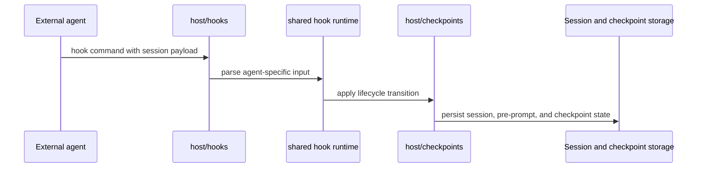

# Bitloops layered extension architecture

This document describes the architecture that is implemented in this repository today. It replaces the earlier simplified view with a description of the actual runtime seams, including the places where Bitloops uses more than one host or registry.

The most important point is that Bitloops does **not** have one generic extension mechanism. It has several related mechanisms:

- `DevqlCapabilityHost` runs executable capability packs.
- `CoreExtensionHost` tracks extension metadata, compatibility, readiness, and language-pack resolution.
- DevQL uses language-pack metadata to select a built-in extraction runtime.
- Agent integrations live under `adapters/agents` and plug into the shared hook and checkpoint runtime.

## High-level view

## Layer summary

| Layer                          | Main modules                                                            | Responsibility                                                                      |
| ------------------------------ | ----------------------------------------------------------------------- | ----------------------------------------------------------------------------------- |
| Presentation                   | `bitloops/src/cli`, `bitloops/src/api`                                  | User-facing entrypoints for DevQL, dashboard, hooks, and test tooling.              |
| Host substrate                 | `bitloops/src/host`                                                     | Orchestration, policy, lifecycle, checkpointing, and registry/reporting.            |
| Executable extensions          | `bitloops/src/capability_packs`                                         | Repository-scoped capabilities executed by DevQL through stages and ingesters.      |
| Runtime adapters               | `bitloops/src/adapters`                                                 | Agent integrations, external knowledge connectors, and model-provider abstractions. |
| Infrastructure and shared code | `bitloops/src/storage`, `config`, `git`, `telemetry`, `utils`, `models` | Storage, config resolution, Git access, logging, helpers, and shared types.         |

## The real architectural boundaries

### 1. Capability packs are runtime extensions

`bitloops/src/host/capability_host` defines the executable capability-pack contract:

- `CapabilityPack`
- `CapabilityRegistrar` (core + knowledge registration surfaces)
- `StageHandler` and `IngesterHandler` for core/non-knowledge packs
- `KnowledgeStageHandler` and `KnowledgeIngesterHandler` for the Knowledge pack
- `CapabilityExecutionContext`, `CapabilityIngestContext`, `CapabilityMigrationContext`
- `KnowledgeExecutionContext`, `KnowledgeIngestContext`, `KnowledgeMigrationContext`
- `MigrationRunner::Core` and `MigrationRunner::Knowledge`
- `CapabilityHealthContext`

The built-in packs registered on this path are:

- `knowledge`
- `test_harness`
- `semantic_clones`

This is the path that actually runs stage and ingester code during `bitloops devql` commands.

### 2. `CoreExtensionHost` is a metadata and readiness host

`bitloops/src/host/extension_host` is not the same thing as `DevqlCapabilityHost`.

It owns:

- language-pack descriptors and profile resolution
- extension capability descriptors
- compatibility checks
- readiness snapshots
- diagnostics
- extension-side migration planning

The built-in language packs on this path are:

- `rust-language-pack`
- `ts-js-language-pack`

The built-in extension capability descriptors on this path are currently:

- `knowledge-capability-pack`
- `test-harness-capability-pack`

That distinction matters because the executable runtime and the descriptor registry are related, but not identical.

### 3. Language adapters are split between metadata and runtime extraction

Bitloops does not currently have a dedicated `adapters/languages` tree. Instead, the language-adapter story is split across two places:

- `CoreExtensionHost` resolves language-pack descriptors and profiles.
- DevQL maps the resolved pack id to a built-in extractor table in `host/devql/ingestion/artefact_persistence.rs`.

Today that runtime table supports:

- Rust extraction
- TypeScript/JavaScript extraction

So language handling is descriptor-driven at selection time, but still built in at execution time.

### 4. Agent adapters are a separate adapter system

`bitloops/src/adapters/agents` is its own architecture.

It contains:

- concrete `Agent` implementations such as Codex, Cursor, Copilot, Gemini, Claude Code, and OpenCode
- a simple `AgentRegistry` for instantiated agents
- a richer `AgentAdapterRegistry` with protocol families, target profiles, package metadata, readiness, and resolution traces
- canonical request/response/lifecycle types
- host-owned policy, provenance, and audit helpers

Those adapters then feed `host/hooks` and `host/checkpoints` rather than the DevQL capability-pack runtime.

## Key runtime flows

### DevQL ingestion

### DevQL query execution

### Agent hook and checkpoint flow

## What is built in today

### Capability packs

- `knowledge`: external knowledge ingestion, versioning, storage, and retrieval
- `test_harness`: test linkage, coverage ingestion, classification, and query stages
- `semantic_clones`: semantic feature and embedding pipeline plus clone-edge rebuild

### Language packs

- Rust
- TypeScript/JavaScript

### Agent adapters

- Claude Code
- Codex
- Copilot
- Cursor
- Gemini
- OpenCode

### Connector adapters

- GitHub
- Jira
- Confluence

## Design consequences

1. The host substrate is intentionally layered, but the layers are not perfectly uniform.
2. Capability-pack execution is centralised in `DevqlCapabilityHost`.
3. Extension metadata and language resolution are centralised in `CoreExtensionHost`.
4. Language execution still depends on a built-in runtime registry keyed by language-pack id.
5. Agent adapters are richer and more self-contained than language adapters.
6. Checkpointing and hook lifecycle are shared across agent integrations rather than implemented per agent.

## Detailed companion documents

- [Host substrate architecture](./layered-extension-architecture-host.md)
- [Capability-pack architecture](./layered-extension-architecture-capability-packs.md)
- [Language-adapter architecture](./layered-extension-architecture-language-adapters.md)
- [Agent-adapter architecture](./layered-extension-architecture-agent-adapters.md)
