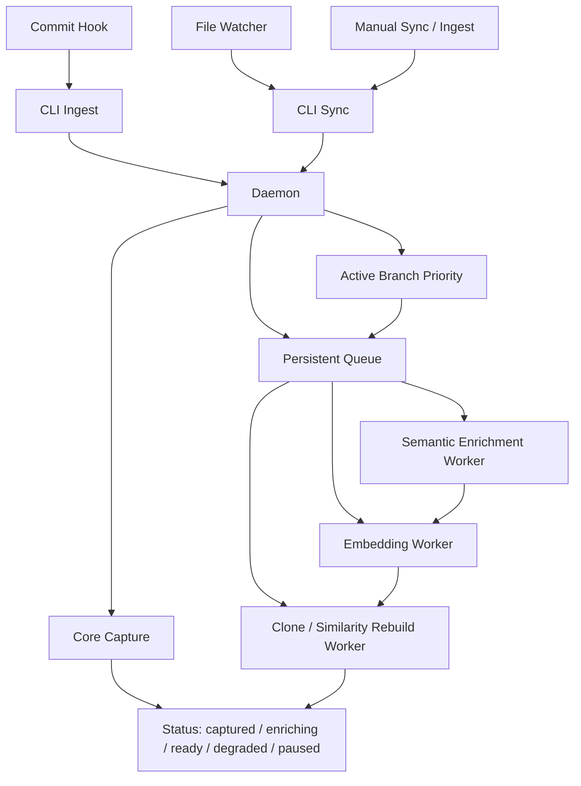

# Resilient Semantic and Embedding Enrichment Plan

**Status:** Draft for discussion.

This document proposes a resilient, daemon-owned enrichment pipeline for semantic summaries, embeddings, and downstream clone or similarity work. The main goal is to keep capture and commit flows fast and reliable while allowing AI-based enrichment to happen asynchronously, degrade gracefully, and recover from failure without breaking the core Bitloops experience.

---

## TL;DR

### Recommended user experience

- Capture stays fast and deterministic.
- Semantic summaries and embeddings run in the background.
- AI failures degrade enrichment quality, but do not fail capture, ingest, or commits.
- The active branch gets priority.
- Large changes should be processed incrementally, not as full-repo recomputation.

### User-facing options

| Area               | Options                                                      | Recommended default    | Meaning                                                                                                                                   |
| ------------------ | ------------------------------------------------------------ | ---------------------- | ----------------------------------------------------------------------------------------------------------------------------------------- |
| Semantic summaries | `off`, `auto`, `paused`                                      | `auto`                 | Use LLM summaries when available, otherwise keep deterministic fallback summaries.                                                        |
| Embeddings         | `deterministic`, `semantic-aware once`, `refresh-on-upgrade` | `semantic-aware once`  | Run embeddings from fallback only, wait for the semantic decision and embed once, or optionally re-embed once later after an LLM upgrade. |
| Processing         | `background`                                                 | `background`           | Semantic and embedding work are daemon-owned async jobs, not commit-time work.                                                            |
| Recovery           | `pause`, `resume`, `retry failed`                            | available to all users | Lets the user control or recover enrichment work without affecting capture.                                                               |

## Summary

### Recommended defaults

- Semantic processing runs in the background through a daemon-owned queue.
- Embeddings run in the background through the same queue.
- Core capture never fails because an LLM or embedding provider failed.
- For large changes, enrich changed symbols first.
- Embeddings default to `semantic-aware once`.
- Active branch work has priority over inactive branch work.
- Inactive-branch current-state jobs are paused or deprioritized, not deleted by default.

---

## Goals

1. Keep commit hooks, watcher sync, and manual ingest fast and deterministic.
2. Prevent provider failures from breaking capture, DevQL, or dashboard usage.
3. Support local models, hosted models, or no model at all.
4. Make system state visible: pending, ready, degraded, paused, or failed.
5. Avoid duplicate and stale enrichment work.
6. Handle branch changes, rebases, resets, and rapid edit bursts safely.

---

## Non-goals

This v1 plan does not attempt to solve:

- full-repo or all-branch semantic/embedding re-enrichment on every commit; it prioritizes changed symbols and the active branch first
- immediate impacted-graph enrichment for every change
- fail-the-commit strict mode for semantic or embedding provider failures
- automatic second embedding pass by default after a later LLM summary upgrade
- equal-priority background processing for all branches regardless of user focus

---

## Proposed Architecture

### Core idea

Use a single daemon-owned persistent queue for all non-critical enrichment work.

### Critical path

These remain synchronous and must succeed:

- file parsing and structural ingest
- artefact and edge persistence
- docstring extraction
- lexical and structural feature extraction
- deterministic fallback summaries
- checkpoint and commit capture
- current-state updates

### Async path

These move to the daemon queue:

- semantic LLM summaries
- embeddings
- clone edges changed rebuilds

### Job model

Each queued job should carry:

- repo id
- branch
- job kind
- commit SHA or workspace generation
- symbol or file target
- input hash or content hash
- priority
- retry metadata
- status

### Queue ownership

- Hooks and CLI emit work only.
- The daemon decides scheduling, retries, dedupe, coalescing, pausing, and cancellation.

---

## Semantic Summary Strategy

### Summary cascade

Every symbol should have a usable summary even without AI:

- docstring summary
- LLM summary when available
- template, lexical, or structural fallback

### Default behavior

- LLM summaries are best-effort.
- If the LLM fails, fallback summaries remain canonical.
- Semantic enrichment becomes `degraded`, not `failed capture`.

### User options

- `semantic = off`
- `semantic = auto`
- `semantic = paused`

---

## Embedding Strategy

### Recommended default: `semantic-aware once`

Embeddings should run once, using the best summary available at decision time:

- if the LLM summary is available, use it
- otherwise use the deterministic fallback summary
- do not automatically re-embed later by default

### Why

- avoids duplicate work
- avoids churn in embeddings
- preserves resilience
- keeps the mental model simple

### User options

- `deterministic`
  - embeddings use the fallback summary only
  - no LLM dependency
- `semantic-aware once`
  - embeddings wait for the semantic decision, then run once
- `refresh-on-upgrade`
  - embeddings may run once from fallback, then rerun once if a better LLM summary arrives later

### Failure behavior

- embedding failure must not fail commit, capture, or ingest
- embedding capability becomes `degraded`
- semantic and structural intelligence remain available

---

## Large Change Handling

### Principle

A change such as 500 modified lines is treated as a resilience and prioritization problem, not as a reason to enrich everything immediately.

### Default behavior

- enrich changed symbols first
- do not enrich all symbols in all touched files immediately
- do not traverse the full impacted dependency graph immediately
- trigger repo-level clone edges rebuild after symbol-level work settles

---

## Branch Switching and Stale Work

### Key rule

The queue alone is not enough. The system also needs:

- staleness detection
- active-branch prioritization
- revalidation before write

### Current-state vs immutable jobs

Treat these differently.

#### Immutable jobs

Safe to keep:

- commit-based enrichment
- checkpoint-based enrichment
- jobs tied to a specific persisted revision

These should usually survive branch switches.

#### Current-state jobs

Potentially stale:

- watcher jobs
- uncommitted workspace jobs
- branch-head current-state enrichments

These must be branch-aware and generation-aware.

### Recommended behavior on branch switch

- keep one global daemon queue
- prioritize the new active branch immediately
- pause or deprioritize old-branch current-state jobs
- keep immutable commit or checkpoint jobs
- discard only obviously stale temporary jobs when superseded

### Worker safety rule

Before persisting results, each worker must re-check:

- branch still relevant
- symbol or file still matches hash
- workspace generation still current
- job not superseded by newer work

If the job is no longer valid, the worker should no-op.

---

## Failure and Recovery Model

### Best-effort default

The system should continue operating when:

- the local embedding runtime is broken
- model download fails
- an API key is missing
- a provider is offline
- a request times out
- the daemon restarts mid-processing

### Recovery mechanisms

- retry with backoff
- circuit breaker for repeated provider failures
- persistent queue across daemon restart
- manual retry control
- pause or resume controls
- degraded health reporting

### Suggested retries

- short retry for transient failures
- escalating backoff
- breaker after repeated provider-specific failures
- manual clear or retry command

---

## Status and User Controls

### Status should show

- queue depth
- semantic state
- embedding state
- clone rebuild state
- last success time
- last error reason
- next retry time
- active-branch priority
- degraded, paused, or disabled state

### User controls

- pause semantic
- pause embeddings
- resume semantic
- resume embeddings
- retry failed jobs
- optionally prioritize the current repo or branch

### User-facing states

- `captured`
- `enriching`
- `ready`
- `degraded`
- `paused`
- `disabled`

---

## Resilience Coverage

This design directly addresses the resilience problems discussed so far:

- `500 lines changed`
  - handled by changed-symbols-first prioritization, queued enrichment, and no whole-repo immediate LLM pass
- embedding failure must not fail the process
  - handled by best-effort defaults, degraded capability state, and synchronous Tier 0 capture staying independent
- rapid edit bursts causing duplicate jobs
  - handled by daemon-owned queue dedupe, coalescing, and input-hash identity
- branch switches or rebases making jobs stale
  - handled by branch-aware jobs, workspace generations, and worker revalidation before write
- local model cold starts, downloads, or broken runtime
  - handled by async processing, retries, degraded state, and non-fatal provider failure
- missing API keys or bad provider config
  - handled by config-time degradation instead of aborting capture
- offline mode or transient network failures
  - handled by retry, backoff, and circuit-breaker behavior
- daemon restarts in the middle of queued work
  - handled by persistent queue and resumable work
- clone rebuild storms after many small commits
  - handled by repo-level coalescing or debounce
- queue starvation when multiple repos are active
  - handled by daemon scheduling, repo-aware prioritization, and concurrency limits
- partial success where structure is captured but AI enrichment is degraded
  - handled by separating deterministic ingest from async AI enrichment
- status opacity where users cannot tell whether the system is behind, paused, or broken
  - handled by explicit health and queue-state reporting

---

## Main Product Decisions Chosen

- Queue is daemon-owned.
- Semantic and embedding work are async by default.
- Capture never fails because AI enrichment failed.
- Changed symbols are enriched first.
- Embeddings default to `semantic-aware once`.
- Re-embedding on later LLM upgrade is advanced opt-in, not the default.
- Active branch first; inactive branch work is opportunistic.
- Branch switch pauses or deprioritizes old current-state work rather than deleting everything.

---

## Alternatives Considered

### Large change strategy

- **Whole touched files first**
  - Rejected as the default because large edits can generate too much low-value work and increase queue pressure.
- **Impacted graph first**
  - Rejected as the default because it expands work unpredictably and makes branch changes and stale-job handling harder.
- **Changed symbols first**
  - Chosen because it keeps the first-pass scope bounded, aligns with the queue-based architecture, and gives the best resilience for large changes such as 500 modified lines.

### Embedding strategy

- **Deterministic only**
  - Strongest resilience, but leaves semantic quality on the table when LLM summaries are available.
- **Fallback first, then always re-embed after LLM**
  - Rejected as the default because it doubles work, increases churn, and complicates reasoning about the current embedding basis.
- **Semantic-aware once**
  - Chosen as the default because it preserves resilience while avoiding duplicate embedding passes in the common case.

### Queue ownership

- **Hooks or CLI own retries**
  - Rejected because it makes commit-time behavior slower, less predictable, and harder to observe.
- **Daemon-owned queue**
  - Chosen because it centralizes scheduling, retries, status, coalescing, and degraded-mode handling.

---

## Open Discussion Items

These still need product discussion before implementation:

- whether users should see one combined AI-enrichment control or separate semantic and embedding controls
- whether inactive-branch jobs should be paused entirely or throttled with a low-priority background budget
- whether clone rebuild should run immediately after each settled batch or on a debounce window
- whether `refresh-on-upgrade` should exist in v1 or wait for a later release

