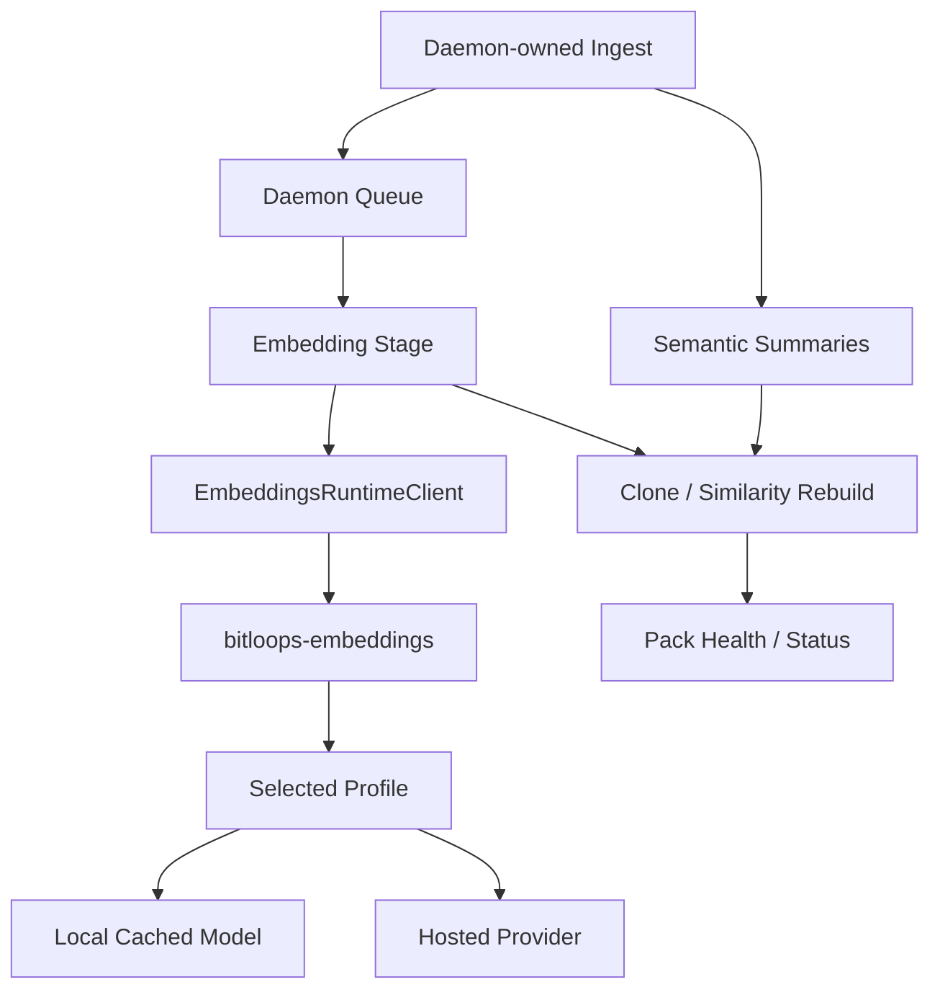

# Standalone Embeddings Runtime Plan

**Status:** Draft for discussion.

This document proposes splitting embedding execution out of the main `bitloops` package into a separately built runtime CLI, `bitloops-embeddings`, while keeping DevQL ingest and daemon orchestration in `bitloops`.

The main goal is to make embeddings explicit, optional, configurable, and failure-isolated without weakening the semantic-summary path or the daemon-owned queue design.

---

## TL;DR

### Recommended direction

- Keep `bitloops` responsible for ingest orchestration, daemon lifecycle, and queue ownership.
- Move all embedding execution into a dedicated CLI, `bitloops-embeddings`.
- Make embeddings opt-in. No embedding profile means embeddings are disabled, not implicitly local.
- Keep semantic summaries independent from embeddings.
- If the embedding runtime or profile is unavailable, ingest still succeeds and skips embedding-dependent work.
- Cache local models such as Jina locally and reuse them across runs instead of redownloading them every time.

### What this buys us

- `bitloops` builds and tests without ONNX or local embedding runtime baggage.
- Broken local models do not break ingest.
- Users can choose local, hosted, or custom embedding setups explicitly.
- Embeddings become a capability with its own health, config, and operational surface.

### One-line product stance

- `semantic summaries = available without embeddings`
- `embeddings = optional capability`
- `local model = cached, not re-downloaded every run`
- `runtime failures = degrade capability, do not fail ingest`

---

## Problem

Today the main `bitloops` package still owns the embedding runtime directly. That means:

- the main build pulls local embedding runtime dependencies
- local ONNX or model runtime issues can affect the main app experience
- embeddings feel implicitly enabled because local is treated as the default
- users do not have a clean way to select a local, hosted, or custom embedding runtime as a first-class choice

This is the wrong coupling for a capability that is:

- optional
- heavy
- model-specific
- failure-prone
- likely to vary across environments

---

## Goals

1. Keep `bitloops` usable and buildable without local embedding runtime dependencies.
2. Make embeddings explicit opt-in rather than implicit default behavior.
3. Allow local and hosted embedding providers under one runtime boundary.
4. Preserve ingest resilience when embedding runtime setup is broken or unavailable.
5. Support local model caching so models are not re-downloaded every run.
6. Leave room for advanced users to plug in custom embedding runtime configurations later.

---

## Non-goals

This plan does not attempt to solve:

- a generic external plugin architecture for all capability packs
- replacing the daemon-owned queue for semantic or embedding work
- making semantic summaries depend on embeddings
- downloading local models on every run
- arbitrary user-supplied raw vector file ingestion as the primary v1 interface

---

## Proposal

### Core idea

Split embeddings into a dedicated runtime CLI:

- `bitloops` remains the daemon, ingest coordinator, and queue owner
- `bitloops-embeddings` becomes the only place where embedding providers execute
- `bitloops` talks to `bitloops-embeddings` through a small versioned JSON protocol over `stdin/stdout`

### Package split

Introduce a repo-root Cargo workspace with at least these members:

- `bitloops`
- `bitloops-embeddings-protocol`
- `bitloops-embeddings`

Optional workspace members can be added as needed for existing crates.

### Runtime boundary

The main app should replace the in-process `EmbeddingProvider` execution path with an `EmbeddingsRuntimeClient` that:

- resolves the selected embedding profile
- spawns `bitloops-embeddings`
- validates the runtime through a `describe` handshake
- sends `embed_batch` requests
- terminates the child process cleanly

This is an embeddings-specific runtime boundary, not a generic capability-host system.

---

## High-level flow



---

## Why this is valuable

### Build and packaging value

- `cargo build -p bitloops` no longer needs local embedding runtime dependencies
- local ONNX-related issues are isolated to the embeddings runtime package
- CI and release can publish the main app and the embeddings runtime separately

### Runtime resilience value

- a broken local runtime does not fail base ingest
- a missing embedding profile does not look like a product failure
- embedding health can be reported independently from semantic-summary health

### Product value

- users can clearly choose whether they want embeddings at all
- users can explicitly pick local or hosted providers
- users can control model version and cache location
- advanced users can later point Bitloops at a custom runtime implementation

---

## Local model behavior

### Recommendation

For local models such as Jina, Bitloops should cache model weights and reuse them across runs.

### What should happen

- the `bitloops-embeddings` binary is built once like any other CLI
- the local model is downloaded on first use or through an explicit prefetch command
- model files are stored in a cache directory
- later runs reuse the cached model
- changing the configured model downloads a new cache entry once
- clearing the cache is an explicit user action

### What should not happen

- no redownload on every ingest
- no model rebuild on every invocation
- no implicit background model change without user config change

### Suggested user-facing commands

- `bitloops embeddings pull <profile>`
- `bitloops embeddings doctor`
- `bitloops embeddings clear-cache <profile>`

---

## Configuration model

### Proposed shape

```toml
[semantic_clones]
embedding_profile = "local"

[embeddings.runtime]
command = "bitloops-embeddings"
args = []
startup_timeout_secs = 10
request_timeout_secs = 60

[embeddings.profiles.local]
kind = "local_fastembed"
model = "jinaai/jina-embeddings-v2-base-code"
cache_dir = "/Users/alex/.cache/bitloops/embeddings/models"

[embeddings.profiles.openai]
kind = "openai"
model = "text-embedding-3-large"
api_key = "${OPENAI_API_KEY}"
base_url = "https://api.openai.com/v1"
```

### Behavior

- if `semantic_clones.embedding_profile` is unset, embeddings are disabled
- if the selected profile resolves and the runtime passes `describe`, embeddings are enabled
- if the selected profile is invalid or the runtime is unavailable, embeddings are skipped and health becomes degraded or disabled

### Compatibility

Legacy embedding settings were removed from the implementation:

- no `stores.embedding_*`
- no `BITLOOPS_DEVQL_EMBEDDING_*`
- no implicit fallback to local
- explicit profile selection only

---

## Runtime protocol

### Operations

The first version can stay very small:

- `describe`
  - validate runtime startup
  - validate selected profile
  - return provider, model, dimension, and capability metadata
- `embed_batch`
  - accept a batch of embedding inputs
  - return vectors and dimension metadata
- `shutdown`
  - terminate cleanly

### Transport

- versioned JSON messages
- `stdin/stdout` transport
- clear structured error shape

### Why not a generic protocol

Embeddings are a narrow, well-understood capability. A dedicated protocol:

- is easier to ship
- is easier to test
- is easier to evolve safely
- avoids prematurely designing a generic plugin API

---

## User options

### Default user journey

- install `bitloops`
- do nothing for embeddings by default
- base ingest and semantic summaries work
- if the user wants embeddings, configure a profile
- if the profile is healthy, embeddings and clone rebuilds run
- if the profile is unhealthy, ingest still succeeds and health reports the issue

### Local user path

- install `bitloops-embeddings`
- choose a local profile
- optionally prefetch the model
- run ingest normally

### Hosted user path

- configure an OpenAI or other hosted profile
- provide credentials explicitly
- run ingest normally

### Advanced/custom path

This should be supported carefully, but it is reasonable to allow one of these paths:

- custom runtime command implementing the `bitloops-embeddings` protocol
- custom HTTP-compatible embedding profile, if the provider contract is stable enough

My recommendation is:

- support profile-based local and hosted providers in v1
- allow runtime command override for advanced users
- avoid arbitrary raw-vector file input as a first-class v1 path

---

## Ingest behavior

### Semantic summaries

Semantic summaries remain independent from embeddings and should still run even when embeddings are disabled.

### Embedding-dependent work

When a healthy embedding profile is configured:

- write `symbol_embeddings`
- rebuild clone or similarity edges

When no embedding profile is configured:

- skip embedding generation
- skip clone-edge rebuild
- ingest succeeds
- capability health reports `disabled`

When a profile is configured but runtime startup or profile validation fails:

- skip embedding generation
- skip clone-edge rebuild
- ingest succeeds
- capability health reports `degraded`

### Stale data policy

If embeddings are skipped because the capability is disabled or broken, the system should have an explicit stale-data policy.

Recommended default:

- clear repo-scoped `symbol_embeddings`
- clear repo-scoped `symbol_clone_edges`

This avoids surfacing stale semantic-clone output when the backing embedding capability is no longer active.

---

## Relationship to the daemon queue

This plan complements the daemon-owned queue design. It does not replace it.

- the queue still owns retries, coalescing, prioritization, and branch-aware scheduling
- the separate embeddings CLI only changes where embeddings execute
- the daemon still decides when embedding jobs should run

So the architecture becomes:

- daemon owns orchestration
- queue owns resilience policy
- `bitloops-embeddings` owns embedding execution

---

## Health and readiness

Health for Semantic Clones should move from a config-only check to an operational check:

- profile resolution check
- runtime command availability check
- `describe` handshake check

Suggested states:

- `disabled`
  - no embedding profile configured
- `healthy`
  - profile resolved and runtime handshake succeeded
- `degraded`
  - profile selected but runtime startup, validation, or provider access failed

These states should surface through pack health commands and dashboard readiness views.

---

## Migration plan

### Phase 1

- add repo-root Cargo workspace
- add `bitloops-embeddings-protocol`
- add `bitloops-embeddings`
- move local and hosted embedding execution code into the new runtime

### Phase 2

- replace in-process embedding provider execution with `EmbeddingsRuntimeClient`
- add explicit profile configuration
- remove implicit local default

### Phase 3

- wire health/readiness to runtime validation
- add model prefetch and cache-management commands
- document local and hosted setup paths

### Phase 4

- deprecate old embedding config inputs
- remove old in-process embedding runtime code from `bitloops`

---

## Alternatives considered

### Keep embeddings in-process

- simplest short-term implementation
- rejected because it keeps local runtime fragility inside the main product and keeps the main build heavier than necessary

### Generic external capability host

- more flexible in theory
- rejected for now because embeddings are a narrow enough problem that a dedicated runtime is simpler and safer

### Keep implicit local default

- convenient for some users
- rejected because it makes an optional heavy capability feel mandatory and causes surprising failures on clean machines

### Redownload local models every run

- operationally simple to reason about
- rejected because it is too slow, wasteful, and hostile to normal local development workflows

---

## Test plan

### Build isolation

- `bitloops` no longer depends on local embedding runtime crates
- `cargo build -p bitloops` succeeds without the embeddings package being required at runtime

### Config resolution

- no embedding config means disabled, not implicit local
- new embeddings runtime and profile sections parse correctly
- legacy settings can still map to compatibility behavior during migration

### Runtime protocol

- `describe` validates local and hosted profiles correctly
- `embed_batch` returns vectors and dimensions correctly
- structured runtime errors are surfaced cleanly

### Ingest integration

- no profile configured: ingest succeeds, embedding-dependent outputs remain empty
- broken runtime: ingest succeeds, health becomes degraded
- healthy local profile: embeddings and clone rebuilds succeed
- healthy hosted profile: embeddings and clone rebuilds succeed

### Local caching

- first local run downloads or resolves the model into cache
- second local run reuses the cache
- model change creates a new cache entry without corrupting the previous one

---

## Main decisions proposed

- Split embedding execution into `bitloops-embeddings`.
- Keep `bitloops` as the daemon and ingest coordinator.
- Make embeddings opt-in and profile-driven.
- Remove implicit local default behavior.
- Cache local models such as Jina rather than redownloading them each run.
- Allow advanced users to override the runtime command later, but keep the default path simple.

---

## Open discussion items

- whether the runtime should be short-lived per batch or kept warm for a bounded session
- whether clone-edge rebuild should be completely disabled when embeddings are disabled, or whether lexical-only clone heuristics should still be available
- whether custom HTTP providers are needed in v1 or should wait until after the standalone runtime lands
- whether the migration should preserve legacy env vars only temporarily or indefinitely
