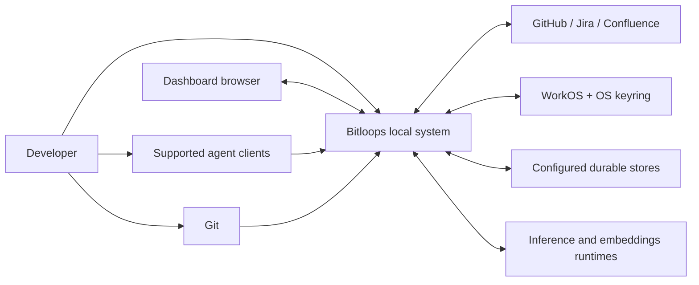

# Bitloops system context

This is the highest-level view. It treats Bitloops as one system and shows the people, tools, and external services around it.

Use this diagram when the question is about product boundaries rather than internal process layout.

## Notes

- The system is local-first from the developer's perspective.
- The main external dependencies are provider integrations, authentication, storage backends, and optional model runtimes.
- This view intentionally hides the split between the CLI, daemon, watcher, and hook surfaces. See the container view for that.

## Glossary

| Term | Beginner explanation |
| --- | --- |
| Developer | The person using Bitloops while working in a repository. |
| Supported agent clients | AI coding tools that Bitloops knows how to integrate with. |
| Git | The version-control tool that tracks commits, branches, and file changes. |
| Dashboard browser | A web browser showing the local Bitloops dashboard. |
| Bitloops local system | The Bitloops software running on the developer's machine. |
| Providers | External tools Bitloops can connect to, such as GitHub, Jira, or Confluence. |
| WorkOS | The authentication provider used for login-related flows. |
| OS keyring | The operating system's secure place for storing secrets such as tokens. |
| Durable stores | Databases or storage backends that keep data after a process exits. |
| Inference runtime | A model runtime that can generate text, summaries, or other AI output. |
| Embeddings runtime | A model runtime that turns text/code into vectors for similarity search. |
| Local-first | The developer's repo and machine are the primary place where Bitloops operates. |
