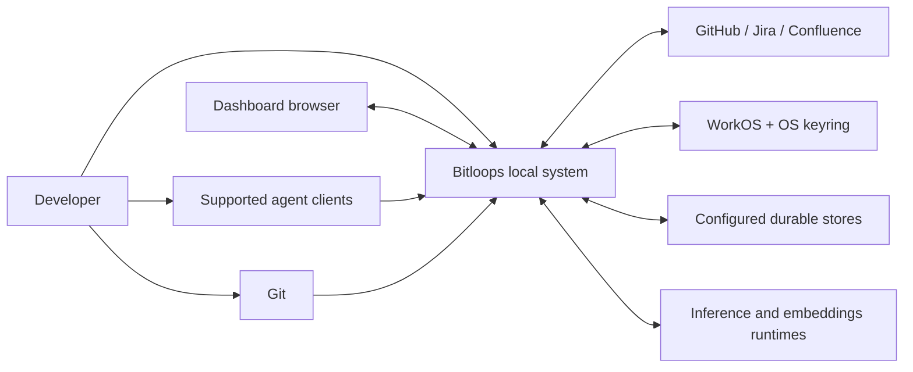

# Bitloops system context

This is the highest-level view. It treats Bitloops as one system and shows the people, tools, and external services around it.

Use this diagram when the question is about product boundaries rather than internal process layout.

## Notes

- The system is local-first from the developer's perspective.
- The main external dependencies are provider integrations, authentication, storage backends, and optional model runtimes.
- This view intentionally hides the split between the CLI, daemon, watcher, and hook surfaces. See the container view for that.
