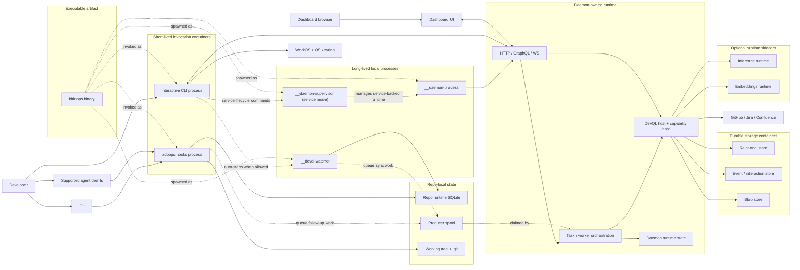

# Bitloops container view

This is the main C4-style container view. Here, "container" means a runtime or storage boundary, not a Docker container.

Use this view when you need to understand how the CLI, daemon, watcher, hooks, and storage surfaces cooperate at runtime.

Important modeling choice:

- `bitloops` is one executable artifact.
- The diagram separates it into distinct runtime processes and invocation roles because that is the architectural boundary that matters operationally.

## Notes

- `Interactive CLI process` and `__daemon-process` are different process boundaries even though they come from the same `bitloops` executable.
- `__daemon-supervisor` is a separate control-plane process used for service-managed daemon lifecycle.
- The daemon is the center of the query and worker runtime.
- The watcher is a distinct background process.
- Hook entrypoints are real runtime boundaries because agents and Git invoke them independently of normal CLI flows.
- The repo runtime store and producer spool are operational state. The relational, event, and blob stores are durable query state.
- Watcher-driven and capture-triggered DevQL follow-up work is staged repo-locally before the daemon claims it.

## What each hidden process is

### `__daemon-process`

- This is the actual long-lived daemon server process.
- It runs the HTTP/GraphQL/dashboard runtime, ensures DevQL storage is current, starts the daemon worker runtime, and writes daemon runtime state in [`bitloops/src/daemon/server_runtime.rs`](https://github.com/bitloops/bitloops/blob/main/bitloops/src/daemon/server_runtime.rs#L42).
- This is the process that serves `/devql`, `/devql/global`, `/devql/runtime`, `/devql/dashboard`, dashboard assets, and related local API traffic.
- In detached and service modes, the CLI spawns this hidden entrypoint.
- In foreground mode, the same server runtime can run directly from the CLI process instead of spawning a separate child.

### `__daemon-supervisor`

- This is not the main daemon server.
- It is a small local control service used for service-managed lifecycle.
- It binds a loopback control listener and exposes `/daemon/start`, `/daemon/stop`, and `/daemon/restart` in [`bitloops/src/daemon/supervisor_api.rs`](https://github.com/bitloops/bitloops/blob/main/bitloops/src/daemon/supervisor_api.rs#L3).
- Its job is to manage the daemon process, not to serve DevQL or dashboard traffic.
- Architecturally it is a control-plane process.

### `__devql-watcher`

- This is a separate background file-watcher process, not the daemon.
- It watches the repo with `notify`, debounces events, filters ignored paths, initializes local watch schema, and registers itself in repo runtime SQLite in [`bitloops/src/host/devql/watch.rs`](https://github.com/bitloops/bitloops/blob/main/bitloops/src/host/devql/watch.rs#L61).
- After batching changes, it computes changed paths, records temporary workspace state, and writes producer-spool jobs for daemon follow-up via [`bitloops/src/host/devql/capture.rs`](https://github.com/bitloops/bitloops/blob/main/bitloops/src/host/devql/capture.rs#L23).
- Its job is to detect filesystem changes and hand off follow-up work through repo-local runtime state.

## Glossary

| Term | Beginner explanation |
| --- | --- |
| C4 container | A separately runnable process, app, or storage boundary. It does not mean Docker here. |
| Executable artifact | The built `bitloops` program file. The same binary can run in several roles. |
| Binary | Another name for a compiled executable program. |
| Interactive CLI process | A short-lived process started when a person runs a Bitloops command. |
| Hook process | A short-lived Bitloops process started automatically by an agent or by Git. |
| Long-lived process | A background process that keeps running after the original command returns. |
| Daemon | A long-running background server that handles local API, query, and worker work. |
| Supervisor | A small control process that starts, stops, or restarts the daemon in service mode. |
| Watcher | A background process that notices repo file changes and queues follow-up sync work. |
| Repo-local state | State stored for one repository, usually under paths tied to that repo. |
| Repo runtime SQLite | A small local SQLite database for operational state about one repo. |
| Producer spool | A repo-local queue where hooks and the watcher leave work for the daemon. |
| Working tree | The checked-out files in the repository directory. |
| `.git` | Git's internal metadata directory for commits, branches, index state, and hooks. |
| HTTP | The request/response protocol used by browsers and local APIs. |
| GraphQL | An API query language used by Bitloops for DevQL and runtime endpoints. |
| WS | WebSocket, a long-lived browser/server connection for live updates. |
| DevQL host | The Bitloops runtime that serves DevQL query and indexing behavior. |
| Capability host | The runtime that loads and invokes Bitloops capability packs. |
| Task / worker orchestration | The scheduling and execution of background work such as sync, ingest, and enrichment. |
| Durable storage | Storage intended to keep useful data across process restarts. |
| Relational store | A structured database for tables and queryable current-state data. |
| Event / interaction store | Storage for historical events, interactions, or workflow history. |
| Blob store | Storage for larger opaque objects that do not fit well in normal database rows. |
| Runtime sidecar | An optional helper process or service used by Bitloops, such as a model runtime. |
| Dashboard UI | The local web interface shown in a browser. |
