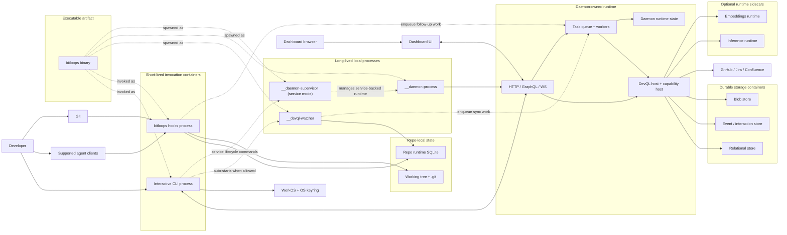

# Bitloops container view

This is the main C4-style container view. Here, "container" means a runtime or storage boundary, not a Docker container.

Use this view when you need to understand how the CLI, daemon, watcher, hooks, and storage surfaces cooperate at runtime.

Important modeling choice:

- `bitloops` is one executable artifact.
- The diagram separates it into distinct runtime processes and invocation roles because that is the architectural boundary that matters operationally.

## Notes

- `Interactive CLI process` and `__daemon-process` are different process boundaries even though they come from the same `bitloops` executable.
- `__daemon-supervisor` is a separate control-plane process used for service-managed daemon lifecycle.
- The daemon is the center of the query and worker runtime.
- The watcher is a distinct background process.
- Hook entrypoints are real runtime boundaries because agents and Git invoke them independently of normal CLI flows.
- The repo runtime store is operational state. The relational, event, and blob stores are durable query state.

## What each hidden process is

### `__daemon-process`

- This is the actual long-lived daemon server process.
- It runs the HTTP/GraphQL/dashboard runtime, ensures DevQL storage is current, starts enrichment coordination, and writes daemon runtime state in [`bitloops/src/daemon/server_runtime.rs`](../../../../bitloops/src/daemon/server_runtime.rs#L42).
- This is the process that serves `/devql`, `/devql/global`, dashboard assets, and related local API traffic.
- In detached and service modes, the CLI spawns this hidden entrypoint.
- In foreground mode, the same server runtime can run directly from the CLI process instead of spawning a separate child.

### `__daemon-supervisor`

- This is not the main daemon server.
- It is a small local control service used for service-managed lifecycle.
- It binds a loopback control listener and exposes `/daemon/start`, `/daemon/stop`, and `/daemon/restart` in [`bitloops/src/daemon/supervisor_api.rs`](../../../../bitloops/src/daemon/supervisor_api.rs#L3).
- Its job is to manage the daemon process, not to serve DevQL or dashboard traffic.
- Architecturally it is a control-plane process.

### `__devql-watcher`

- This is a separate background file-watcher process, not the daemon.
- It watches the repo with `notify`, debounces events, filters ignored paths, initializes local watch schema, and registers itself in repo runtime SQLite in [`bitloops/src/host/devql/watch.rs`](../../../../bitloops/src/host/devql/watch.rs#L61).
- After batching changes, it computes changed paths and enqueues sync work with source `Watcher` via [`bitloops/src/host/devql/capture.rs`](../../../../bitloops/src/host/devql/capture.rs#L23).
- Its job is to detect filesystem changes and hand off sync work.
