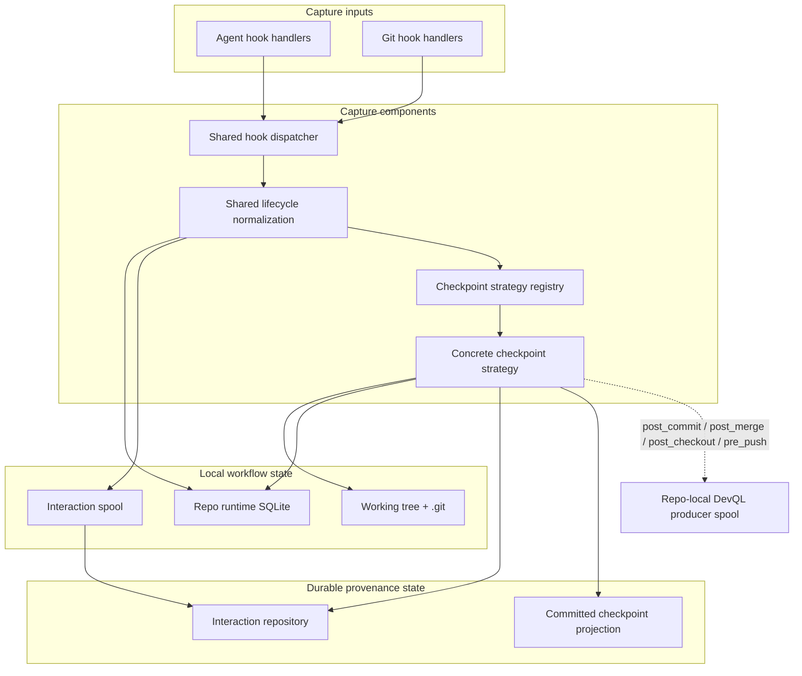

# Bitloops capture and checkpointing components

This component view covers the capture plane only. It is about provenance, session state, and checkpoint formation, not repo-state sync.

Use this when the question is "how do agent events and Git hooks become checkpoints and workflow history?"

## Notes

- Agent-native hook payloads are normalized into one shared lifecycle before checkpoint logic runs.
- The checkpoint strategy is where temporary snapshots, task checkpoints, and commit-linked checkpoint consolidation happen.
- `post_commit` and related Git lifecycle events can hand work off to DevQL through the repo-local producer spool, but that handoff is downstream of capture rather than the capture flow itself.
