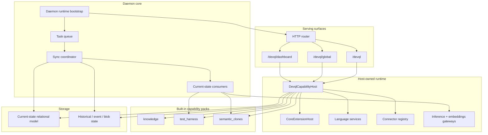

# Bitloops daemon and DevQL components

This component view focuses on the daemon-side runtime: HTTP and GraphQL serving, task execution, DevQL orchestration, capability packs, and post-sync consumers.

Use this when the question is "what runs inside the daemon, and how does DevQL execution relate to sync and enrichment?"

## Notes

- The GraphQL surfaces are distinct product interfaces, even though they share the same daemon runtime.
- The daemon owns task execution and async follow-up work.
- The host owns capability execution, language resolution, connector access, and storage access beneath the GraphQL contract.
- Sync and post-sync consumers are part of the daemon runtime, not the capture plane.
