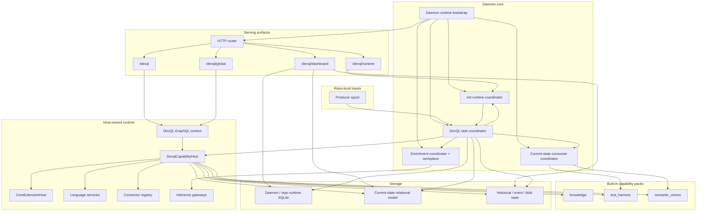

# Bitloops daemon and DevQL components

This component view focuses on the daemon-side runtime: HTTP and GraphQL serving, task execution, DevQL orchestration, capability packs, and post-sync consumers.

Use this when the question is "what runs inside the daemon, and how does DevQL execution relate to sync and enrichment?"

## Notes

- The daemon now exposes four distinct GraphQL surfaces: `/devql`, `/devql/global`, `/devql/runtime`, and `/devql/dashboard`.
- The DevQL task coordinator is the main async entrypoint for sync, ingest, bootstrap, and producer-spool work.
- Current-state consumer execution, enrichment, and init/runtime orchestration are separate daemon coordinators rather than one generic sync queue.
- `/devql/runtime` and `/devql/dashboard` are operational surfaces alongside the DevQL query surfaces; they are not just aliases for capability-host execution.
- The host still owns capability execution, language resolution, connector access, and storage access beneath the DevQL GraphQL contract.
