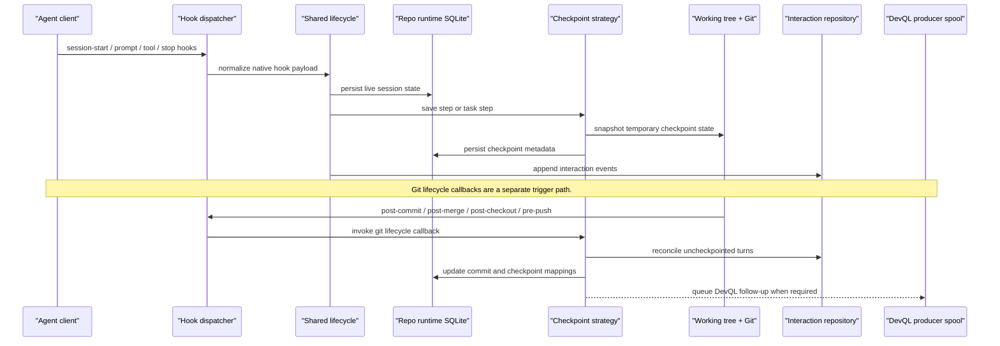

# Bitloops capture lifecycle

This is the main dynamic view for capture and checkpointing. It shows how agent hooks and Git hooks flow through the shared lifecycle and checkpoint strategy.

Use this when the question is "what side effects happen when a session progresses or a commit is made?"

## Notes

- Capture is about provenance and checkpoint formation.
- The strategy decides how session turns map to temporary or committed checkpoints.
- Git lifecycle callbacks can queue repo-local DevQL follow-up work, but that does not make sync part of the capture flow.
