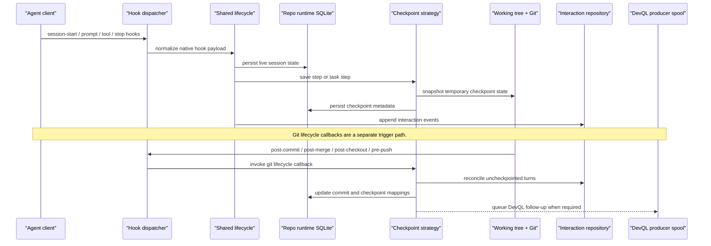

# Bitloops capture lifecycle

This is the main dynamic view for capture and checkpointing. It shows how agent hooks and Git hooks flow through the shared lifecycle and checkpoint strategy.

Use this when the question is "what side effects happen when a session progresses or a commit is made?"

## Notes

- Capture is about provenance and checkpoint formation.
- The strategy decides how session turns map to temporary or committed checkpoints.
- Git lifecycle callbacks can queue repo-local DevQL follow-up work, but that does not make sync part of the capture flow.

## Glossary

| Term | Beginner explanation |
| --- | --- |
| Capture | Recording what happened during an agent or Git workflow so it can be explained later. |
| Provenance | The history of where a piece of state came from and what caused it. |
| Checkpoint | A saved snapshot or marker that ties work to repo state. |
| Agent client | An AI coding tool integrated with Bitloops. |
| Hook | Code that runs automatically when an agent or Git reaches a lifecycle point. |
| Hook dispatcher | Shared Bitloops code that routes hook events to the right handler. |
| Shared lifecycle | The common event model Bitloops uses after normalizing different agent hook formats. |
| Native hook payload | The original event data sent by a specific agent or by Git. |
| Repo runtime SQLite | A small local SQLite database for operational state about one repo. |
| Checkpoint strategy | The policy that decides how session activity becomes temporary or committed checkpoints. |
| Temporary checkpoint | A checkpoint for work that is not necessarily tied to a final Git commit yet. |
| Working tree | The checked-out files in the repository directory. |
| Interaction repository | Storage for recorded user, agent, and workflow events. |
| DevQL producer spool | A repo-local queue where follow-up DevQL work is staged for the daemon. |
| `post-commit` | A Git hook that runs after a commit is created. |
| `post-merge` | A Git hook that runs after Git completes a merge or pull. |
| `post-checkout` | A Git hook that runs after changing branches or checking out files. |
| `pre-push` | A Git hook that runs before Git pushes commits to a remote. |
