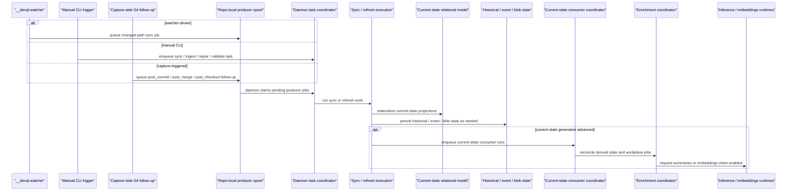

# Bitloops sync and materialization flow

This is the main dynamic view for DevQL sync. It shows how sync work is triggered, executed, and followed by consumer and enrichment stages.

Use this when the question is "how does repo state become current-state DevQL data?"

## Notes

- Sync is a daemon-owned materialization pipeline.
- Watcher-driven and capture-triggered follow-up work lands in the repo-local producer spool before the daemon claims it.
- Explicit CLI commands enqueue daemon tasks directly, while producer-spool jobs are drained by the same daemon task coordinator.
- Current-state consumers and enrichment are downstream stages after current-state generation advances.
