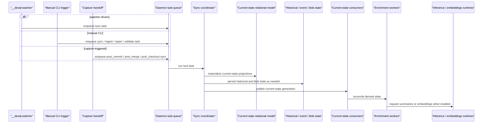

# Bitloops sync and materialization flow

This is the main dynamic view for DevQL sync. It shows how sync work is triggered, executed, and followed by consumer and enrichment stages.

Use this when the question is "how does repo state become current-state DevQL data?"

## Notes

- Sync is a daemon-owned materialization pipeline.
- Sync can be triggered by the watcher, by explicit CLI commands, or by a handoff from capture-side Git lifecycle events.
- Post-sync consumers and enrichment are separate stages after sync succeeds.
