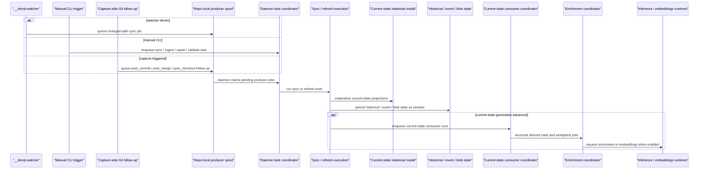

# Bitloops sync and materialization flow

This is the main dynamic view for DevQL sync. It shows how sync work is triggered, executed, and followed by consumer and enrichment stages.

Use this when the question is "how does repo state become current-state DevQL data?"

## Notes

- Sync is a daemon-owned materialization pipeline.
- Watcher-driven and capture-triggered follow-up work lands in the repo-local producer spool before the daemon claims it.
- Explicit CLI commands enqueue daemon tasks directly, while producer-spool jobs are drained by the same daemon task coordinator.
- Current-state consumers and enrichment are downstream stages after current-state generation advances.
- Producer ownership, allowed hook/watcher overlap, and QAT assertion policy are documented in [../devql-sync-producer-ownership.md](../devql-sync-producer-ownership.md).

## Glossary

| Term | Beginner explanation |
| --- | --- |
| DevQL | Bitloops' repo-aware query and indexing layer. |
| Sync | Work that updates DevQL data so it matches the current repository state. |
| Materialization | Turning raw repo or event data into queryable database rows. |
| Watcher | A background process that notices file changes in the repo. |
| Manual CLI trigger | A Bitloops command a person runs directly in the terminal. |
| Capture-side Git follow-up | Work queued after a Git hook observes a commit, merge, checkout, or push. |
| Repo-local producer spool | A queue stored near the repo where producers leave work for the daemon. |
| Producer | Any source that creates follow-up work, such as init, the watcher, a Git hook, or a CLI command. |
| Daemon task coordinator | The daemon component that accepts, orders, and runs background tasks. |
| Sync / refresh execution | The actual task work that reads repo state and updates DevQL storage. |
| Current-state relational model | Database tables representing what the repo looks like now. |
| Historical state | Stored facts about previous commits, events, or interactions. |
| Event state | Stored records of things that happened. |
| Blob state | Stored larger objects that do not fit well in ordinary database columns. |
| Current-state consumer | A downstream worker that reacts after current-state data changes. |
| Enrichment | Extra processing that derives summaries, embeddings, or other helpful metadata. |
| Workplane jobs | Queued enrichment work for a capability pack. |
| Inference runtime | A model runtime that can generate text or summaries. |
| Embeddings runtime | A model runtime that turns text/code into vectors for similarity search. |
| QAT | Quality-assurance tests that exercise product-level behavior. |
