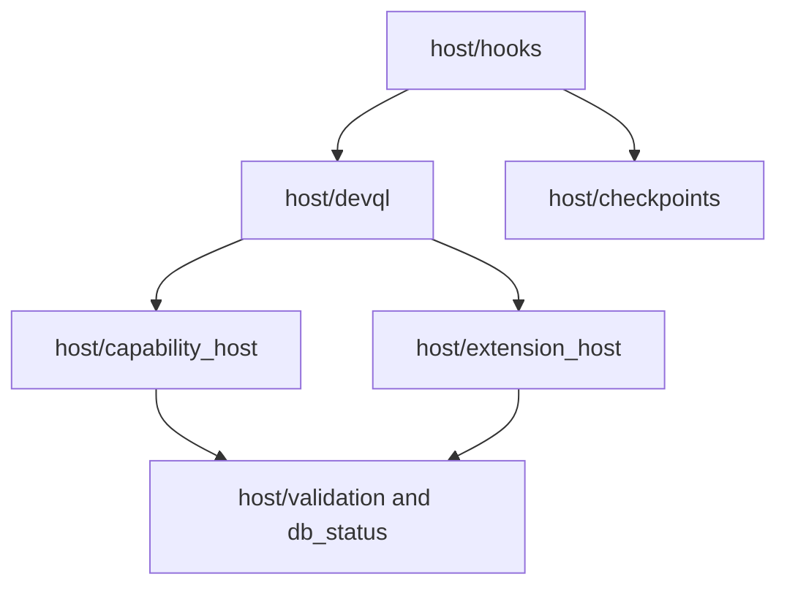

# Bitloops host substrate architecture

This document describes the modules under `bitloops/src/host` and how they cooperate. The host substrate is not a single runtime object; it is a set of cooperating subsystems.

## Host map

## Responsibilities by module

| Module                              | Responsibility                                                                                                         |
| ----------------------------------- | ---------------------------------------------------------------------------------------------------------------------- |
| `host/devql`                        | Composition root for DevQL ingest, init, query, language-pack selection, and capability-pack reporting.                |
| `host/capability_host`              | Executable capability-pack runtime, invocation policy, migrations, health checks, and runtime contexts.                |
| `host/extension_host`               | Descriptor registry for language packs and extension capability packs, plus compatibility, readiness, and diagnostics. |
| `host/hooks`                        | Agent and Git hook dispatch plus shared hook runtime.                                                                  |
| `host/checkpoints`                  | Session state machine, strategies, transcript parsing, checkpoint storage, and history.                                |
| `host/validation`, `host/db_status` | Validation and backend-status helpers used by higher layers.                                                           |

## `DevqlCapabilityHost`: executable pack runtime

`host/capability_host` is the runtime that knows how to execute first-party capability packs.

### Core contract

The main contract is defined by:

- `CapabilityPack`
- `CapabilityRegistrar`
- `StageHandler` and `IngesterHandler` (core/non-knowledge)
- `KnowledgeStageHandler` and `KnowledgeIngesterHandler` (knowledge)
- `CapabilityExecutionContext`
- `CapabilityIngestContext`
- `CapabilityMigrationContext`
- `KnowledgeExecutionContext`
- `KnowledgeIngestContext`
- `KnowledgeMigrationContext`
- `MigrationRunner::Core` and `MigrationRunner::Knowledge`
- `CapabilityHealthContext`

### Main runtime object

`DevqlCapabilityHost` owns:

- registered pack descriptors
- stage registrations
- ingester registrations
- schema-module registrations
- query examples
- pack migrations
- pack health checks
- host invocation policy
- cross-pack access policy

### Runtime resources

`LocalCapabilityRuntimeResources` builds the concrete host-owned runtime surface for packs:

- repo identity and repo root
- merged config root
- host relational gateway
- knowledge relational repository
- knowledge document repository
- blob payload store
- connector registry
- provenance builder
- canonical graph gateway
- store-health gateway

This is how packs access storage and connectors without opening their own infrastructure directly in normal runtime paths.

### Policy and safety

`host/capability_host/policy.rs` defines:

- stage timeout
- ingester timeout
- DevQL subquery timeout
- cross-pack grants for registered-stage composition

This means the host, not the pack, decides wall-clock limits and cross-pack access.

Migration execution is also host-owned and typed:

- `MigrationRunner::Core` receives `CapabilityMigrationContext`
- `MigrationRunner::Knowledge` receives `KnowledgeMigrationContext`

### Reporting

`host/capability_host/diagnostics.rs` produces the registry and lifecycle reports behind `bitloops devql packs`.

The report includes:

- registered packs
- stages
- ingesters
- migrations
- schema modules
- health checks
- query example counts
- invocation policy
- cross-pack grants

## `CoreExtensionHost`: descriptor and readiness host

`host/extension_host` is the metadata side of the architecture.

### What it registers

Built-in bootstrap currently registers:

- language packs: Rust and TypeScript/JavaScript
- extension capability descriptors: Knowledge and Test Harness

### What it validates

It validates:

- contract version
- runtime version
- supported runtimes
- required host features
- identifier, alias, and contribution ownership

### What it resolves

It resolves:

- language-pack ids and aliases
- language profiles
- supported languages and file extensions
- capability stage owners
- capability ingester owners

### What it reports

It produces readiness and registry snapshots containing:

- registered language packs
- registered extension capability packs
- migration plan
- migrated pack ids
- readiness reports
- registration observations
- diagnostics

### Why it exists separately

This host is deliberately lightweight. It does not execute pack stage code. It answers questions such as:

- which language pack owns this file?
- which capability descriptor owns this ingester id?
- is this extension compatible with the current host contract?
- is this extension ready?

## `host/devql`: composition root and orchestration layer

`host/devql.rs` ties the pieces together for DevQL commands.

### Main jobs

It is responsible for:

- resolving repository identity
- constructing `DevqlCapabilityHost`
- constructing or bootstrapping `CoreExtensionHost`
- initialising relational schema
- running ingestion
- running queries
- building the combined `devql packs` report
- resolving language-pack owners during ingestion

### Important detail: language resolution versus execution

`host/devql` asks `CoreExtensionHost` to resolve a language pack, but it then maps the resolved pack id to a built-in runtime extractor table in `host/devql/ingestion/artefact_persistence.rs`.

So DevQL already uses extension-host metadata, but execution remains built in.

### Capability-pack reporting

`run_capability_packs_report` can optionally combine both hosts:

- `DevqlCapabilityHost` report
- `CoreExtensionHost` report

That is why `bitloops devql packs --with-extensions` is the most accurate runtime snapshot.

## `host/hooks` and `host/checkpoints`: shared lifecycle runtime for agents

The hook path is separate from capability-pack execution.

### `host/hooks`

This module provides:

- `bitloops hooks ...` command dispatch
- agent-specific hook verbs
- routing from raw hook input into shared lifecycle handlers
- shared hook runtime helpers in `host/hooks/runtime`

### `host/checkpoints`

This module provides:

- session state and phase transitions
- checkpoint strategies such as manual and auto commit
- transcript parsing and storage
- history and summarisation support
- session backends and pre-prompt state

### Architectural role

This design avoids re-implementing checkpoint behaviour in each agent adapter. Agents provide hook shapes and transcript behaviour; the host owns checkpoint semantics.

## Important current splits

### Split 1: executable packs versus descriptor packs

There are two pack registries because they solve different problems:

- `DevqlCapabilityHost` runs executable code.
- `CoreExtensionHost` tracks extension metadata and readiness.

That is intentional, but it means architecture docs must not flatten them into one box.

### Split 2: language-pack metadata versus language runtime

Language resolution is extension-host driven, but extraction is still wired through a built-in runtime table keyed by pack id.

This is the main place where Bitloops is layered but not yet fully pluggable.

### Split 3: agent adapters versus capability packs

Agent adapters do not run through `DevqlCapabilityHost`. They run through `host/hooks` and `host/checkpoints`.

That is why agent integration has its own registry, canonical model, and policy surface.

## Recommended reading order

1. [High-level layered architecture](./layered-extension-architecture.md)
2. [Capability-pack architecture](./capability-packs.md)
3. [Language-adapter architecture](./language-adapters.md)
4. [Agent-adapter architecture](./agent-adapters.md)
